# `kubectl debug` is missing an IDE option 
🔧 Let’s fix that! 🪛

---
hideInToc: true
background: /normal-slide-background.svg
---

# Agenda

<Toc />

---
layout: section
hideInToc: true
---

# But first...

---
hideInToc: true
---

# The Prononciation Debate

<div class="text-size-9xl text-center">
`kubectl`
</div>

<div grid="~ cols-3 gap-4">

<div v-click class="text-size-5xl text-center border">
kube c-t-l
</div>

<div v-click class="text-size-5xl text-center border">
kube cuttle
</div>

<div v-click class="text-size-5xl text-center border">
kube control
</div>

</div>

---
hideInToc: true
layout: image
image: ./kubectl-prononciation.svg
backgroundSize: 60%
---

# The Prononciation Debate
Let's keep it simple

---
hide: true
---
# Mario Loriedo
@mariolet

Podman core team member.<br>
Cloud Development Environments for the last 7 years.<br>
A fanatical full-time open sourceror.<br>

Blah blah blah

---
layout: section
---

# The Art of Debugging Pods

---
hideInToc: true
layout: image-right
image: ./ritual.jpg
backgroundSize: contain
---

# The Pod Debug Ritual
A Neverending Story

<br/>

<div v-click class="text-size-3xl">
😇  `k apply`
</div>

<div v-click class="text-size-3xl">
😐  `k get pod`
</div>

<div v-click class="text-size-3xl">
🫤  `k describe pod`
</div>

<div v-click class="text-size-3xl">
🤨 `k get pod -o json`
</div>

<div v-click class="text-size-3xl">
😤 `k get events`
</div>

<div v-click class="text-size-3xl">
😳 `k logs`
</div>

<div v-click class="text-size-3xl">
😭 `k exec`
</div>

<div v-click class="text-size-3xl">
🤬 `k debug`
</div>

<!--
Reference: https://kubernetes.io/docs/reference/kubectl/generated/kubectl_debug/
-->

---
hideInToc: true
---

# `k debug`
Pod Troubleshooting by Copy

<div grid="~ cols-2">

<div>
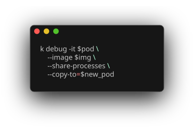
</div>

<div>
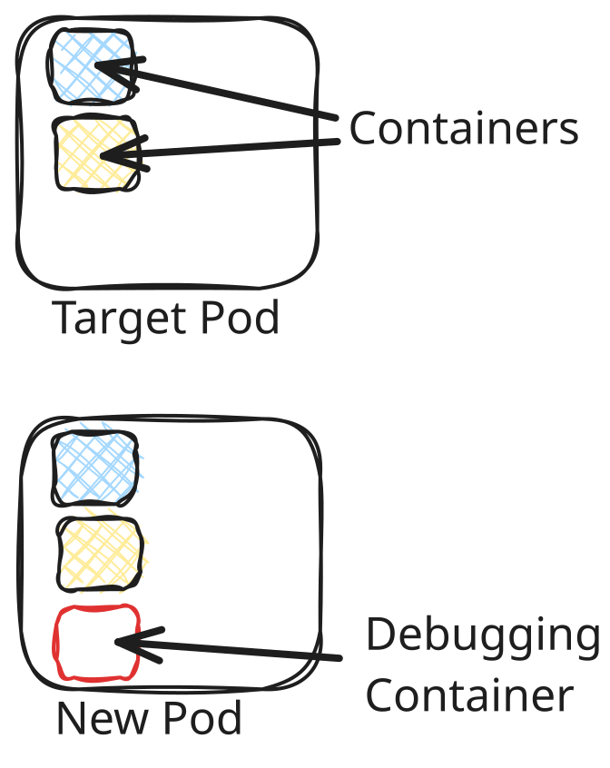
</div>

</div>

<!--
References:
https://kubernetes.io/docs/tasks/debug/debug-application/debug-running-pod/
https://github.com/kubernetes/enhancements/blob/master/keps/sig-cli/1441-kubectl-debug/README.md
-->


---
hideInToc: true
hide: false
---

# `k debug`
Pod Troubleshooting with Ephemeral Debug Container

<div grid="~ cols-2 gap-4">

<div>
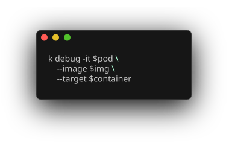
</div>

<div>
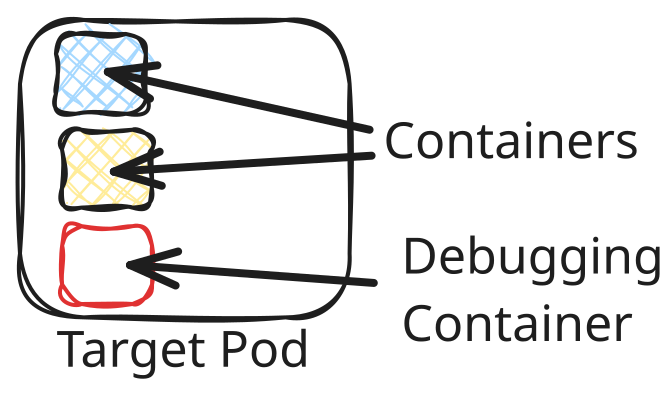
</div>

</div>

---
hideInToc: true
---

# Demo 1

`k debug` (the copy alternative)

<div>
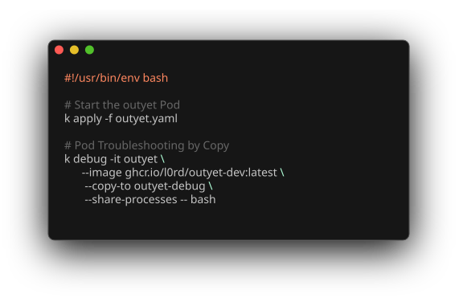
</div>

<!-- 
```bash
# kubectl apply -f ./config
# oc expose pod/outyet
# oc expose svc outyet
# kubectl debug -it outyet --image ghcr.io/l0rd/outyet-dev:latest --target outyet
kubectl debug -it outyet --image ghcr.io/l0rd/outyet-dev:latest --copy-to outyet-debug --share-processes -- bash
ps -ef
git clone https://github.com/l0rd/outyet
cd outyet && go build
go install github.com/go-delve/delve/cmd/dlv@latest
dlv debug ...
```
-->

---
hideInToc: true
layout: image
image: ./debug-without-an-ide.png
backgroundSize: 60%
---

---
layout: section
---

# Cloud Development Environments
Containerized Development Environments. IDE included

---
hideInToc: true
layout: two-cols-header
---

# Cloud Development Environments (CDEs)
A Growing Market

::left::

<div>
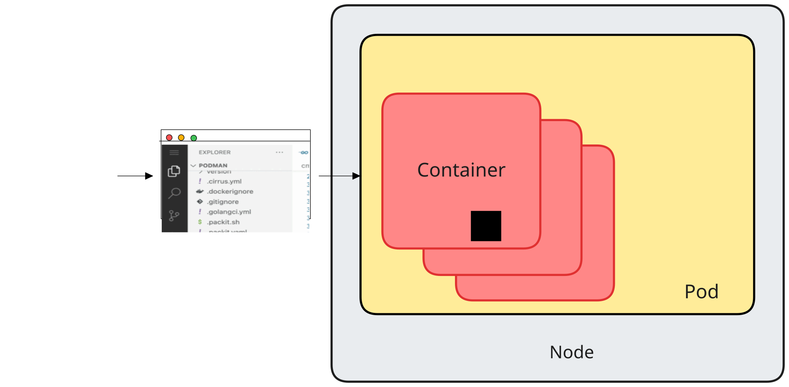
</div>

::right::

<div>
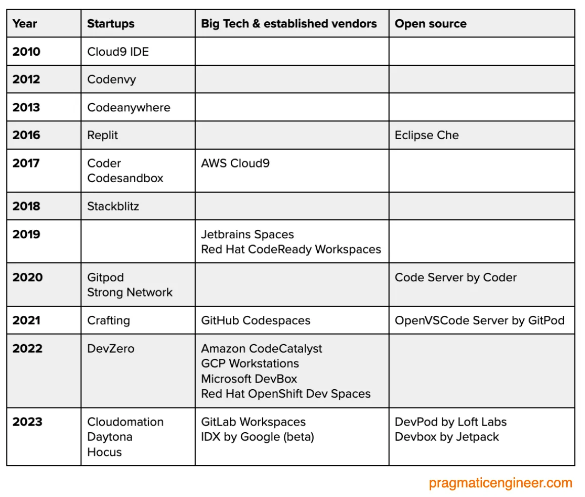
</div>

<!--
Reference https://newsletter.pragmaticengineer.com/p/cloud-development-environment-vendors
-->

---
hideInToc: true
layout: two-cols-header
---

# A CNCF Project to Run CDEs on Kubernetes 
The DevWorkspace Kubernetes Operator

::left::

```yaml twoslash
kind: DevWorkspace
apiVersion: workspace.devfile.io/v1alpha2
metadata:
  name: dw
spec:
  started: true
  template:
    projects:
      - name: outyet
        git:
          remotes:
            origin: https://github.com/l0rd/outyet.git
    components:
      - name: dev-tooling
        container:
          image: ghcr.io/l0rd/outyet-dev:latest
  contributions:
    - name: editor
      kubernetes:
        name: vscode
```

::right::

<div>
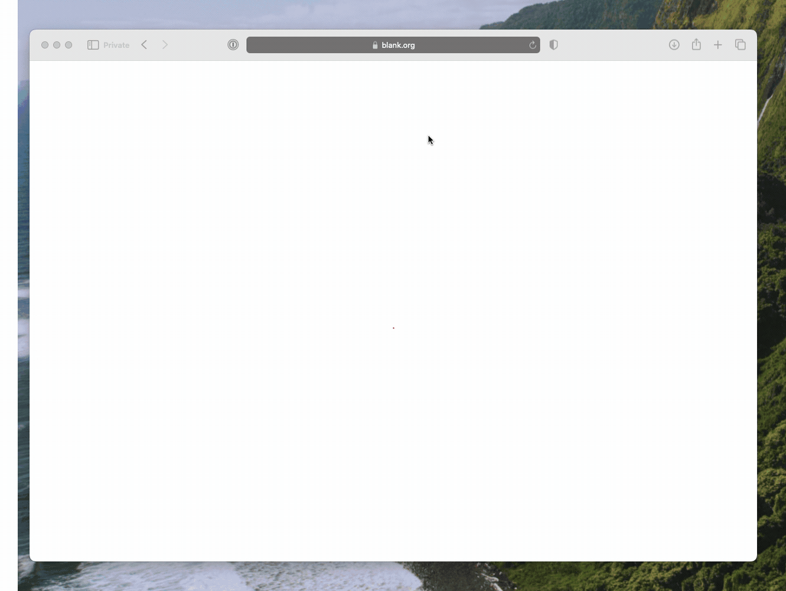
</div>

---
hideInToc: true
---

# Demo 2
Deploy and Use a CDE

<div>
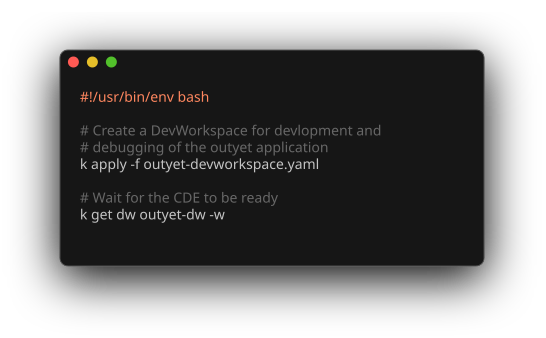
</div>

---
hideInToc: true
layout: image
image: ./k-debug-cde.png
backgroundSize: 60%
---


---
layout: section
---

# Extending `kubectl`

---
hideInToc: true
layout: two-cols-header
---

# The Plugin Mechanism
Plugins extend `kubectl` with new sub-commands

::left::

<div>
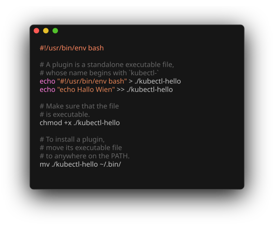
</div>

::right::

```bash
$ k plugin list
```
<div>
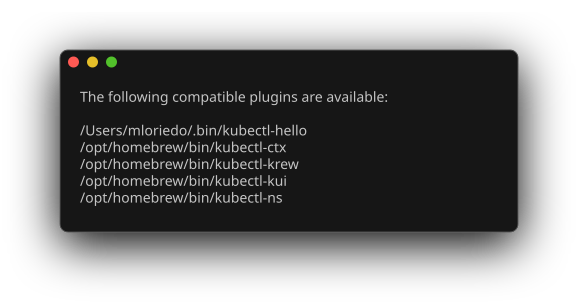
</div>
<div>
```bash
$ k hello
```
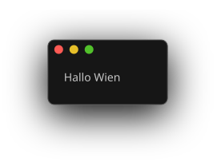
</div>

<!--
https://kubernetes.io/docs/tasks/extend-kubectl/kubectl-plugins/
https://github.com/kubernetes/sample-cli-plugin
https://github.com/kubernetes/cli-runtime
 -->
---
hideInToc: true
layout: image
image: ./k-debug-ide-help.svg
backgroundSize: 100%
---

```bash
$ k debug-ide
```

---
hideInToc: true
---

# Demo 3
`kubectl debug-ide`

<div>
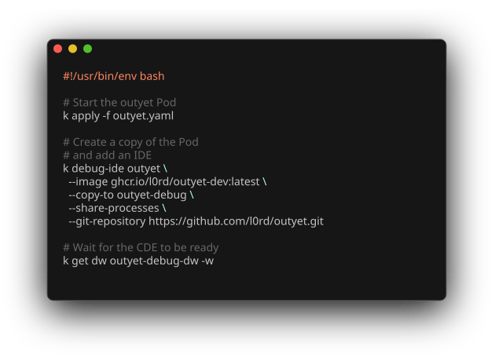
</div>

---
hideInToc: true
---

# Links
To Learn More

https://kubernetes.io/docs/tasks/debug/debug-application/debug-running-pod/ <br>
https://github.com/devfile/devworkspace-operator/tree/main <br>
https://github.com/kubernetes/sample-cli-plugin <br>

---
hideInToc: true
layout: end
---

# Thank You

