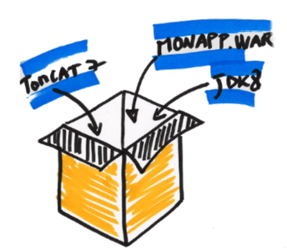
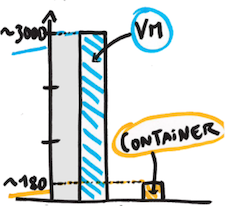
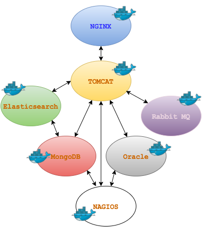
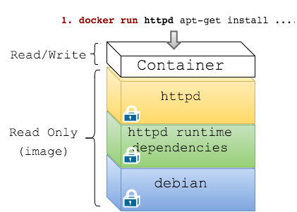
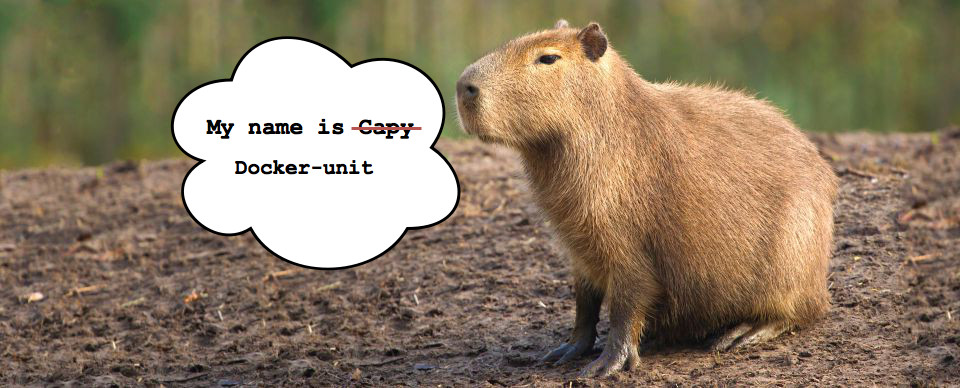

name: inverse
layout: true
class: center, middle, inverse
---

# Test Driven Infrastructure with Docker
[ou comment appliquer le TDD à l'infrastructure]

---
layout: false
.left-column[
  ## Agenda
]
.right-column[
<br><br><br>
.large[

1. Docker en 10 minutes

2. Code et Infrastructure

3. Test Driven Infrastructure

4. Détails d'un build Docker

7. Docker-unit
]
]

---

template: inverse

## Hello

---


.large[
.left[Je suis Mario...................................]
.left[CTO @ Zenika Paris.......................]
.left[Docker certified trainer..............]
.left[[doclipser](https://github.com/domeide/doclipser) and [sublime docker](https://github.com/domeide/sublime-docker)......]


.left[[mariolet](https://twitter.com/mariolet)........................................]
.left[[l0rd](https://github.com/l0rd)................................................]
]

---
template: inverse

## Docker en 10 minutes
[avantages par rapport aux VMs traditionelles et utilisation]

---

.left-column[
  ## Docker en 10 minutes
  ### Comme une .red[VM]
]
.right-column[
### Les conteneurs sont comme des VM traditionelles
]
<br><br><br><br><br><br><br><br><br>
--
   
--

---

.left-column[
  ## Docker en 10 minutes
  ### Comme une .red[VM]
  ### .red[Pas] une VM
]
.right-column[
### Les conteneurs ne sont .red[pas] des VM
]
<br><br><br><br><br><br><br><br><br>
--
 
--

---

.left-column[
  ## Docker en 10 minutes
  ### Comme une .red[VM]
  ### .red[Pas] une VM
  ### docker run
]
.right-column[


### Création et execution d'un conteneur

```bash
docker run -d tomcat
```


### Création et execution de plusieurs conteneurs

```bash
for i in `seq 1 5`; do 
  docker run -d -P --name tomcat$i tomcat;
done
```

### Différent types de images sont disponibles

```bash
docker run tomcat
docker run ubuntu
docker run java
docker run jira
docker run mariolet/hello-world
```
]

---

.left-column[
  ## Docker en 10 minutes
  ### Comme une .red[VM]
  ### .red[Pas] une VM
  ### docker run
  ### Hub et Images
]
.right-column[

### Les images sont récupérés du DockerHub .red[*]
.center[]

### Les images sont découpées en couches
.center[]
]

.footnote[.red[*] or any Docker registry]
---
layout: false
.left-column[
  ## Docker en 10 minutes
  ### Comme une .red[VM]
  ### .red[Pas] une VM
  ### docker run
  ### Hub et Images
  ### Images custom
]
.right-column[

### Il est possible fabriquer des images custom à partir d'un Dockerfile

```Dockerfile
FROM tomcat

RUN useradd -d /home/tomcat -m -s /bin/bash tomcat

COPY hello-rouen.war /usr/local/tomcat/webapps/

# define containers default command
CMD catalina.sh run
```

```bash
docker build -t hello-rouen .
```

### L'image est construite au dessus de l'image de base
.center[]

]

---
template: inverse

## Code et Infrastructure
[les bonnes pratiques de développement appliquées à l'infrastructure]

---

.left-column[
## Code et Infrastructure
### Infrastructure as code
]
.right-column[
### Le provisioning et la configuration de l'infrastructure sont définis dans des fichiers de code source
<br>

]

---

.left-column[
## Code et Infrastructure
### Infrastructure as code
### Outils
]
.right-column[
<br>
.pull-left[
.red[Configuration Management]
<pre><code>- Ansible
- Chef
- Puppet
</code></pre>
]
.pull-right[
.red[Docker Inc.]
<pre><code>- Docker compose
- Docker swarm
- Docker machine
</code></pre>
]
.pull-left[
.red[Containers Engines]
<pre><code>- Docker
- rocket
- runc
</code></pre>
]
.pull-right[
.red[Shedulers]
<pre><code>- Kubernetes
- Mesos
 
</code></pre>
]
.pull-left[
.red[Service Discovery]
<pre><code>- Consul
- etcd
- zookeeper
</code></pre>
]
.pull-right[
.red[Load Balancers]
<pre><code>- HAProxy
- Traefik
- NGINX
</code></pre>
]

]

---

.left-column[
  ## Code et Infrastructure
  ### Infrastructure as code
  ### Outils
  ### Bonnes pratiques
]
.right-column[
### Un des avantages de l'Infrastructure as Code c'est la possibilité d'appliquer les .red[pratiques d'ingénierie logicielle] à l'infrastructure :


### * Source code versionning

### * Design patterns

### * Déploiements fréquents

### * Tests automatisés
  
]

---

template: inverse

## Test Driven Infrastructure
[les bénéfices des tests et de l'approche TDD]

---

.left-column[
## Test Driven Infrastructure
### Types de tests
]
.right-column[
### Tests unitaires
Tests des unitées qui constituent l'infrastructure (e.g. test d'une image Docker)
<br>
### Tests d'intégration
Tests de l'intégration des composants dans l'infrastructure (e.g. avec un compose file)
<br>
### Tests d'accéptance
Test de scenario d'utilisation de l'infrastucture (e.g. ServerSpec et Kitchen CI)
<br>
### Tests de sécurité
Audit de l'infrastructure en analysant le code (e.g. projet Nautilus de Docker)
<br>
### Tests de perf ...
Stress test de l'infrastructure
]

---

.left-column[
## Test Driven Infrastructure
### Types de tests
### L'intérêt des tests
]
.right-column[
### Sans tests automatisés le coût d'un changement augmente exponentiellement en fonction du temps
<br><br>
<br>
image source: [InfoQ.com](http://www.infoq.com/articles/agile-practice-patterns&rct)
]

---

.left-column[
## Test Driven Infrastructure
### Types de tests
### L'intérêt des tests
]
.right-column[
### Plus tard on trouve un bug plus cher sera le fix
<br><br> 

  
]

---

.left-column[
## Test Driven Infrastructure
### Types de tests
### L'intérêt des tests
### Dockefile unit testing
]
.right-column[

### Dockerfile Unit Testing
<br><br>


]

---

.left-column[
## Test Driven Infrastructure
### Types de tests
### L'intérêt des tests
### Dockefile unit testing
]
.right-column[

### Dockerfile Unit Testing
<br><br>


Deux propriétés importantes des tests unitaires :

- Les tests ne doivent pas avoir de effets de bord sur l'image générée

- Les tests doivent se trouver sur un fichier séparé 

]

---

.left-column[
## Test Driven Infrastructure
### Types de tests
### L'intérêt des tests
### Dockefile Unit Testing
### Test Driven
]
.right-column[
### Dockerfile Test Driven Development
<br><br>
.large[.red[Red]] : Écrire un test et verifier qu'il ne passe pas.
<br><br>


.large[.green[Green]] : Écrire le code du Dockerfile nécéssaire à faire passer le test.
<br><br>


.large[Refactor] : Améliorer le code du Dockerfile en vérifiant que les tests passent toujours.

]

---

template: inverse

## Détails d'un build Docker
[comment éviter de commiter les layers de test]

---

.left-column[
## Détails d'un build Docker
### Build manuel 1...
]
.right-column[
### La première étape d'un build consiste à créer un conteneur temporaire : une couche R/W est créé au dessus d'une image.
<br><br>


]

---

.left-column[
## Détails d'un build Docker
### Build manuel 1...2...
]
.right-column[

### La deuxième étape est un `docker commit`: une nouvelle image est créé à partir du conteneur. 
<br><br>


]

---

.left-column[
## Détails d'un build Docker
### Build manuel 1...2...3
]
.right-column[

### La troisième et dernière étape consiste à éliminer le conteneur temporaire. 
<br><br>


]

---

.left-column[
## Détails d'un build Docker
### Build manuel 1...2...3
### Build d'un Dockerfile
]
.right-column[

```Dockerfile
FROM tomcat

RUN useradd -d /home/tomcat -m -s /bin/bash tomcat

COPY hello-rouen.war /usr/local/tomcat/webapps/
```


Pour chaque instruction du Dockerfile les 3 étapes manuelles sont répétées automatiquement :
.large[1. `docker run`
2. `docker commit`
3. `docker rm`
]
]

---

.left-column[
## Détails d'un build Docker
### Build manuel 1...2...3
### Build d'un Dockerfile
### Injéction de tests
]
.right-column[

```Dockerfile
FROM tomcat

RUN useradd -d /home/tomcat -m -s /bin/bash tomcat

``` 

```Dockerfile
# test previous step
RUN test -f /home/tomcat/.profile
```

```Dockerfile
COPY hello-rouen.war /usr/local/tomcat/webapps/
```

Mais dans le cas du tests il faudrait avoir :

.large[1. `docker run`
2. ~~`docker commit`~~
3. `docker rm`
]
]

---

template: inverse

## Docker-unit
[ JUnit pour Dockerfile]

---



### Framework de test pour Dockerfile

- Les tests sont décrits dans des fichiers séparés (Dockerfile_test)
- Les tests n'ont pas de effet de bord sur les images
- Se base sur le projet `dockramp`
- Le code se trouve sur github


---

.left-column[
  ## Docker-unit
  ### Features
  #### - EPHEMERAL
]
.right-column[
### Support de l'instruction EPHEMERAL dans les Dockerfile

```Docker
# Exemple de test qui vérifie si le file foo.txt existe
EPHEMERAL test -f foo.txt
```

Dans le cas de l'instruction `EPHEMERAL` l'operation `commit` n'est pas exécutée :
.large[1. `docker run`
2. ~~`docker commit`~~
3. `docker rm`
]
]

---

.left-column[
## Docker-unit
### Features
#### - EPHEMERAL
#### - Testfile
]
.right-column[
### Support de Testfile et de ASSERT

```Dockerfile
# Dockerfile_test

ASSERT_TRUE $(whoami)=mario # => EPHEMERAL test $(whoami)=mario

ASSERT_FALSE -f foo.txt      # => EPHEMERAL test ! -f foo.txt
```
]

---

.left-column[
## Docker-unit
### Features
#### - EPHEMERAL
#### - Testfile
#### - Before/After
]
.right-column[
### Support des instructions @BEFORE et @AFTER

```Dockerfile
# Dockerfile_test

@BEFORE RUN_USERADD
ASSERT_TRUE $(whoami)=root

@AFTER COPY_HELLO
ASSERT_TRUE -f /usr/local/tomcat/webapps/hello-rouen.war
```

```Dockerfile
# Dockerfile

RUN useradd -d /home/mario -u 1000 -m -s /bin/bash mario

COPY hello-rouen.war /usr/local/tomcat/webapps/
```
]

---

.left-column[
## Docker-unit
### Features
#### - EPHEMERAL
#### - Testfile
#### - Before/After
#### - Resultats
]
.right-column[

### Affichage des résultats des tests

```bash
$ docker-unit .
(...)
----
Run 4 tests: 4 PASS and 0 FAIL
----
```
]

---

.left-column[
## Docker-unit
### Features
#### - EPHEMERAL
#### - Testfile
#### - Before/After
#### - Resultats
#### - Templates
]
.right-column[
### Support de tests prédéfinis (templates)
- `FILE_EXISTS` foo.txt 
- `OS_VERSION_MATCH` "ubuntu 14.04"
- `CURRENT_USER_MATCH` "mario"
- `IS_INSTALLED` "vim"
- `IS_RUNNING` "httpd"
- `IS_LISTENING_ON_PORT` 80
]

---

.left-column[
## Docker-unit
### Features
### Démo
]
.right-column[
<br><br>

.right[]
.right[[http://www.commitstrip.com/en/](http://www.commitstrip.com/en/)]
]

---

.left-column[
## Docker-unit
### Features
### Démo
### Next version
#### - INCLUDE
]
.right-column[
### Support de @INCLUDE

```Dockerfile
# Capyfile

@AFTER CREATE_FOO
@INCLUDE test_foo.sh
ASSERT_TRUE test_foo.sh
```
]

---

.left-column[
## Docker-unit
### Features
### Démo
### Next version
#### - INCLUDE
#### - IMPORT
]
.right-column[
### Support de @IMPORT
```Dockerfile
# Capyfile

@AFTER CREATE_FOO
@IMPORT serverspec
@IMPORT bats
ASSERT_TRUE test_foo.sh

```
]

---

.left-column[
  ## Docker-unit
## Docker-unit
### Features
### Démo
### Next version
#### - INCLUDE
#### - IMPORT
#### - SETUP
]
.right-column[
### Support de @SETUP and @TEARDOWN
```Dockerfile
# Capyfile

@SETUP
@IMPORT bats

```
]


---

.left-column[
## Docker-unit
### Features
### Démo
### Next version
### Roadmap
]
.right-column[
### Docker-unit Roadmap
<br><br>

- .green[~~Support de l'instruction `EPHEMERAL` dans les Dockerfile~~]

- .green[~~Support de Capyfile et de `ASSERT_TRUE`~~]

- .green[~~Affichage de résultats des tests~~]

- .green[~~Support des instructions `@BEFORE` et `@AFTER`~~]

- .green[~~Support de tests pré-définis~~]

- Support de `@INCLUDE`

- Support de `@SETUP` and `@TEARDOWN`

]

---

.left-column[
  ## Conclusion
]
.right-column[
<br><br>

- Les conteneurs ne sont pas des VM

- Les pratiques de ing. logicielles appliquées à l'infra

- Test Driven Infrastructure avec Docker

- Docker-unit : JUnit pour Dockerfile

]

---

template: inverse

## merci
http://github.com/l0rd/docker-unit/

http://l0rd.github.com/talks/capy/

@mariolet

mario.loriedo@zenika.com
