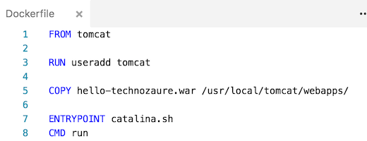
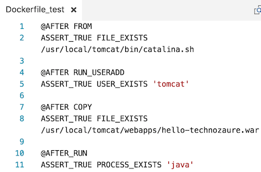
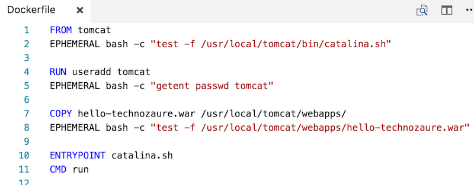

name: inverse
layout: true
class: center, middle, inverse
---
background-image: url(images/background_devoxx.png)
background-position: center

# cUnit, le xUnit pour conteneurs
[et comment développer l'infra en TDD]
 
---
background-image: url(images/mario1.png)

.footnote[
  .left[.yellow[github.com/l0rd] ]
  .right[.yellow[twitter.com/mariolet] ] 
]
---
background-image: url(images/mario2.png)

.footnote[
  .left[.yellow[github.com/l0rd] ]
  .right[.yellow[twitter.com/mariolet] ] 
]
---
background-image: url(images/mario3.png)

.footnote[
  .left[.yellow[github.com/l0rd] ]
  .right[.yellow[twitter.com/mariolet] ] 
]
---

background-image: url(images/che.gif)

---

background-image: url(images/mario4.png)

.footnote[
  .left[.yellow[github.com/l0rd] ]
  .right[.yellow[twitter.com/mariolet] ] 
]
---

background-image: url(images/mario5.png)

.footnote[
  .left[.yellow[github.com/l0rd] ]
  .right[.yellow[twitter.com/mariolet] ] 
]
---


---


---

template: inverse

## Les Dockerfiles

---
layout:false

<br><br>
<br><br>
<br><br>
<br><br>
```Dockerfile
FROM tomcat

RUN useradd tomcat

USER tomcat

COPY hello-world.war /usr/local/tomcat/webapps/

# define containers default command
CMD catalina.sh run
```
---

background-image: url(images/longdockerfiletrimmed.gif)

---

.center[
  <br>
  <br>
  <br>
  <br>
  
]

---

template: inverse

## cUnit

---

### Le Dockerfile

```Dockerfile
# Dockerfile

RUN useradd mario

COPY hello-rouen.war /usr/local/tomcat/webapps/
```

### Le Fichier de test

```Dockerfile
# Dockerfile_test

@BEFORE RUN_USERADD
ASSERT_FALSE USER_EXISTS "mario"

@AFTER COPY_HELLO
ASSERT_TRUE FILE_EXISTS /usr/local/tomcat/webapps/hello-rouen.war
```


### Affichage des résultats des tests

```bash
$ cunit .
(...)
----
Run 4 tests: 4 PASS and 0 FAIL
----
```
---

template: inverse

## Demo
[Test Driven Infra]

---

template: inverse

## cUnit internals

---

## Dockerfile et fichier de test

 <br><br>


---

## Résultat de la phase de parsing



---

template: inverse

## merci
http://github.com/l0rd/cunit/

http://l0rd.github.com/talks/cunit/

@mariolet

mloriedo@redhat.com
