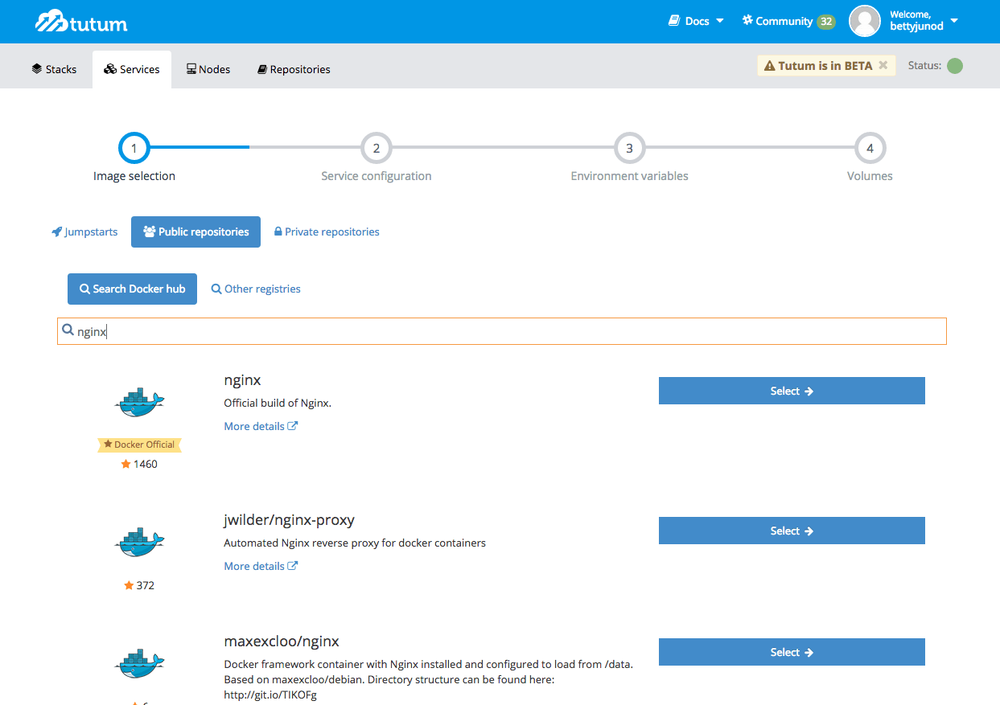
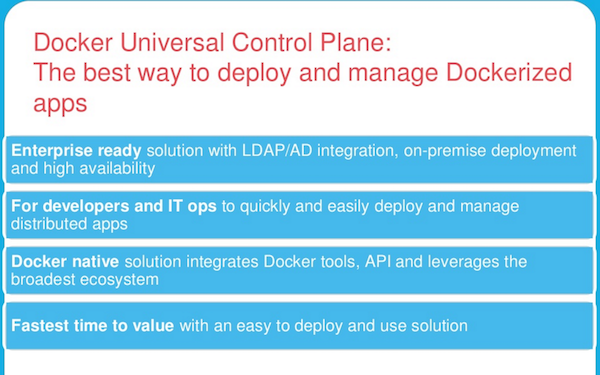
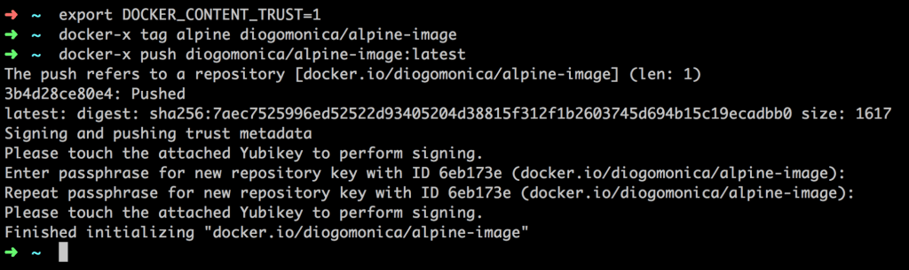
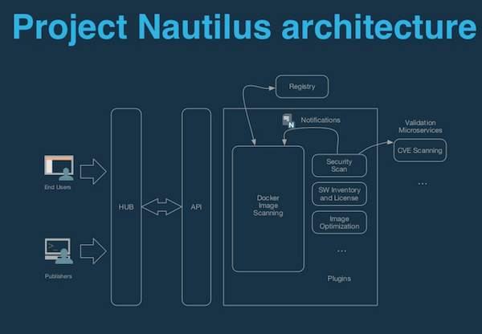
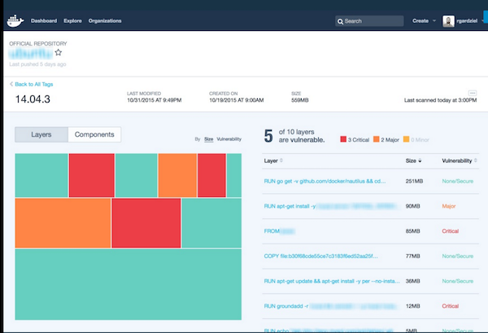

name: inverse
layout: true
class: center, middle, inverse
---

layout: false
template: inverse
# DockerCon Europe 2015
[docker run hola-mundo]

---

background-repeat: cover
background-image: url(images/hola-mundo.jpg)

---

layout: false
.left-column[
  ## Les sujets de la DockerCon
]
.right-column[

- Docker 1.9

- Swarm 1.0

- Le futur du Docker Engine

- Tutum

- Docker Universal Control Plane

- Docker Content Trust + Hardware Crypto

- Project Nautilus

- More stuff

]

---

template: inverse

## Hello

---

.large[
.left[Je suis Mario...................................]
.left[CTO @ Zenika Paris.......................]
.left[Docker certified trainer..............]
.left[[doclipser](https://github.com/domeide/doclipser) and [sublime docker](https://github.com/domeide/sublime-docker)......]

.left[[mariolet](https://twitter.com/mariolet)........................................]
.left[[l0rd](https://github.com/l0rd)................................................]
]

---
template: inverse

## Docker Engine 1.9
---
background-repeat: cover
background-image: url(images/docker1.9.jpg)
---

.large[
  
- Multihost networking
  
- Network plugins
  
- Volumes plugins
]
---
template: inverse

## Docker Swarm 1.0
---
background-repeat: cover
background-image: url(images/swarm1.0.jpg)
---

.large[
  
- 1,000 nodes et 30,000 containers (avec scheduling des containers en moins d'une demi seconde)
  
- Support du Multihost Networking et des plugins de Volumes
  
- Docker-compose sur multi-host
]
---
template: inverse

## Le futur du Docker Engine
---
background-repeat: cover
background-image: url(images/arnaud.jpg)
---

.large[
Changemets du format des images :
]

- Nouveau manifest pour supporter plusieures architectures (ARM, PPC)

- Layers et images ne seront plus la même chose

.large[

Amélioration de sécurité :
]

- Docker content trust par défault

- User namespace plus stables

- API de authorisation/authentication

.large[

Build et runtime se séparent

Engine et swarm convèrgent

]
.footnote[http://www.slideshare.net/Docker/the-latest-on-docker-engine-55435952]

---

template: inverse

## Tutum
---
background-repeat: cover
background-image: url(images/tutum.jpg)
---

.large[
Build, Ship… and .red[Run]
]
  - Provision (docker engines)
  - Deploy (containers)
  - Manage (updates an monitoring)

---
template: inverse

## Docker Universal Control Plane
---
background-repeat: cover
background-image: url(images/ducp.jpg)
---
class: center

  

.left[
.footnote[http://www.slideshare.net/Docker/gordons-special-session-docker-universal-control-plane]
]
---
template: inverse

## Docker Content Trust + Hardware Crypto
---
background-repeat: cover
background-image: url(images/crypto-key.jpg)
---

.large[
- Signature des images
- YubiKey 4 de Yubico supportée
- Experimental release
]

---
template: inverse

## Projet Nautilus
---
background-repeat: cover
background-image: url(images/nautilus.jpg)
---

.large[
Docker image scanning :
]
- Sécurité
- Contenu des images
- Optimisation

---
class: center
  

.left[
.footnote[http://www.slideshare.net/Docker/official-repos-and-project-nautilus]
]
---
template: inverse

## More stuff
---
background-repeat: cover
background-image: url(images/jessie.jpg)
---

.large[

  
Windows server containers .red[* ]
  

Tor + Docker = anonymous ♥  .red[** ]
]

.footnote[
.red[*] http://www.slideshare.net/Docker/windows-server-containers-how-we-hot-here-and-architecture-deep-dive

.red[**] https://www.youtube.com/watch?v=4u8egQ7rvMk
]

---
template: inverse

## merci
[mario.loriedo@zenika.com]

[@mariolet]
