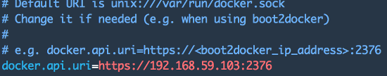

name: inverse
layout: true
class: center, middle, inverse
---

# doclipser
[or how I've put Docker in your favorite IDE]

---
layout: false
.left-column[
  ## Agenda
]
.right-column[
<br><br><br>
.large[

1. Short Docker intro

2. doclipser (usage)

3. doclipser (development)
]
]

---

template: inverse

## Hello
[my name is Mario]

---


.large[
.left[My name is Mario..........................]
.left[CTO @ Zenika Paris.......................]
.left[Docker certified trainer..............]
.left[[doclipser](https://github.com/domeide/doclipser) and [sublime docker](https://github.com/domeide/sublime-docker)......]


.left[[mariolet](https://twitter.com/mariolet)........................................]
.left[[l0rd](https://github.com/l0rd)................................................]
]

---
template: inverse

## Short Docker introduction
[#@#$!! what's that containers thing again #@#$!!?]

---

.left-column[
  ## Docker short intro
  ### As a .red[VM]
]
.right-column[
### Containers are like traditional VMs
]
<br><br><br><br><br><br><br><br><br>
--
   
--

---

.left-column[
  ## Docker short intro
  ### As a .red[VM]
  ### .red[Not] a VM
]
.right-column[
### Containers are different than traditional VMs
]
<br><br><br><br><br><br><br><br><br>
--
 
--

---

.left-column[
  ## Docker short intro
  ### As a .red[VM]
  ### .red[Not] a VM
  ### docker run
]
.right-column[


### Container creation and execution

```bash
docker run -d tomcat
```


### Multiple containers creation and execution

```bash
for i in `seq 1 5`; do 
  docker run -d -P --name tomcat$i tomcat;
done
```

### Containers are running instances of images

```bash
docker run tomcat
docker run ubuntu
docker run java
docker run jira
docker run mariolet/hello-world
```
]

---

.left-column[
  ## Docker short intro
  ### As a .red[VM]
  ### .red[Not] a VM
  ### docker run
  ### Hub Images
]
.right-column[

### Images can be downloaded from the DockerHub .red[*]
<br><br>

TODO

### Images are made of layers
.center[]
]

.footnote[.red[*] or any Docker registry]
---
layout: false
.left-column[
  ## Docker short intro
  ### As a .red[VM]
  ### .red[Not] a VM
  ### docker run
  ### Hub Images
  ### Custom images
]
.right-column[

### Custom images can be build from a Dockerfile

```Dockerfile
FROM tomcat

# copy application in web app folder
COPY hello-eclipsecon.war /usr/local/tomcat/webapps/ROOT.war

# define containers default command
CMD catalina.sh run
```

```bash
docker build -t hello-eclipsecon ./project-dir
```

### Resulting image is built on top of the base image
TODO
]
---
layout: false
.left-column[
  ## Docker short intro
  ### As a .red[VM]
  ### .red[Not] a VM
  ### docker run
  ### Hub Images
  ### Custom images
  ### Use cases
]
.right-column[

### Docker use cases in development environments
]
--
.right-column[
#### Docker can be used as run tool (we just saw it)

```bash
docker run -d hello-eclipsecon
```
]
--
.right-column[
#### Docker can be used as build tool too !

```Dockerfile
FROM maven

COPY src /usr/local/src
WORKDIR /usr/local/src

CMD mvn 
```

```bash
docker build -t mvn-dock .
```

```bash
docker run mvn-dock clean install
docker run mvn-dock test
```
]

---
class: center, middle, doclipser

background-image: url(images/doclipser-main-logo.png)

## &nbsp;&nbsp;&nbsp;&nbsp;&nbsp;&nbsp;&nbsp;&nbsp;&nbsp;&nbsp;&nbsp;&nbsp;&nbsp;&nbsp;&nbsp;&nbsp;&nbsp;&nbsp;&nbsp;&nbsp;&nbsp;&nbsp;&nbsp;&nbsp;&nbsp;&nbsp;&nbsp;&nbsp;&nbsp;&nbsp;&nbsp;&nbsp;&nbsp;&nbsp;&nbsp;&nbsp;&nbsp;doclipser
&nbsp;&nbsp;&nbsp;&nbsp;&nbsp;&nbsp;&nbsp;&nbsp;&nbsp;&nbsp;&nbsp;&nbsp;&nbsp;&nbsp;&nbsp;&nbsp;&nbsp;&nbsp;&nbsp;&nbsp;&nbsp;&nbsp;&nbsp;&nbsp;&nbsp;&nbsp;&nbsp;&nbsp;&nbsp;&nbsp;&nbsp;&nbsp;&nbsp;&nbsp;&nbsp;&nbsp;&nbsp;&nbsp;&nbsp;&nbsp;&nbsp;[usage]

---
.left-column[
  ## doclipser [usage]
  ### IDEs
]
.right-column[
### Docker and IDEs
<br><br>

]   
---
.left-column[
  ## doclipser [usage]
  ### IDEs
  ### Features
]
.right-column[
### Common IDEs Docker support features 
<br><br>

]   
---
.left-column[
  ## doclipser [usage]
  ### IDEs
  ### Features
  ### doclipser
]
.right-column[
### Prerequisites
### Configuration

### Dockerfile editor

### Containers run

<br><br>
]   
---
.left-column[
  ## doclipser [usage]
  ### IDEs
  ### Features
  ### doclipser
  ### Demo
]
.right-column[
### Demo Time!
<br><br>

]   
---
class: center, middle, doclipser

background-image: url(images/doclipser-main-logo.png)

## &nbsp;&nbsp;&nbsp;&nbsp;&nbsp;&nbsp;&nbsp;&nbsp;&nbsp;&nbsp;&nbsp;&nbsp;&nbsp;&nbsp;&nbsp;&nbsp;&nbsp;&nbsp;&nbsp;&nbsp;&nbsp;&nbsp;&nbsp;&nbsp;&nbsp;&nbsp;&nbsp;&nbsp;&nbsp;&nbsp;&nbsp;&nbsp;&nbsp;&nbsp;&nbsp;&nbsp;&nbsp;doclipser
&nbsp;&nbsp;&nbsp;&nbsp;&nbsp;&nbsp;&nbsp;&nbsp;&nbsp;&nbsp;&nbsp;&nbsp;&nbsp;&nbsp;&nbsp;&nbsp;&nbsp;&nbsp;&nbsp;&nbsp;&nbsp;&nbsp;&nbsp;&nbsp;&nbsp;&nbsp;&nbsp;&nbsp;&nbsp;&nbsp;&nbsp;&nbsp;&nbsp;&nbsp;&nbsp;&nbsp;&nbsp;&nbsp;&nbsp;&nbsp;&nbsp;[development]

---
.left-column[
  ## doclipser [dev]
  ### Dockerfile
]
.right-column[
### Dockerfile support
+ Xtext plugin

+ Easy grammar definition

+ Syntax highlighting, autocomplete, 

+ Unit testing


]
---
.left-column[
  ## doclipser [dev]
  ### Dockerfile
  ### Containers run
]
.right-column[
### Run of Dockerfile containers

+ Docker API developed by Spotify

+ Eclipse Jobs


]
---
.left-column[
  ## doclipser [dev]
  ### Dockerfile
  ### Containers run
  ### Build automation
]
.right-column[
### How are the plugins automated build

+ GitHub repo

+ CircleCI

+ Maven Tycho

+ BinTray


]
---
.left-column[
  ## doclipser [dev]
  ### Dockerfile
  ### Containers run
  ### Build automation
  ### Current issues
]
.right-column[
### doclipser current issues

+ Dockerfiles name limitation

+ Volumes and links

+ Manual configuration

+ Java 6 support
]

---

.left-column[
  ## doclipser [dev]
  ### Dockerfile
  ### Containers run
  ### Build automation
  ### Current issues
  ### Roadmap
]
.right-column[

### doclipser roadmap

+ Add "File->New->Dockerfile" menu item

+ Quick-fixes for Dockefiles

+ Remove limitation on Dockerfile names

+ Make Docker properties configurable via the UI

+ Support Docker Compose files

]

---

template: inverse

## merci
[mario.loriedo@zenika.com]

[@mariolet]
