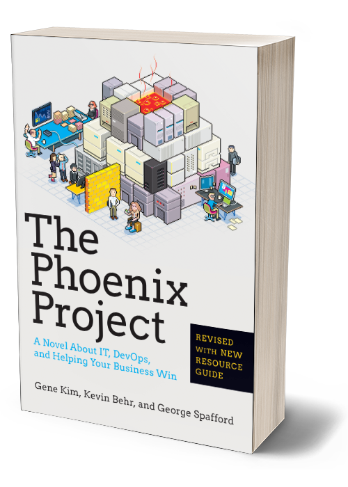

title: Boost your Java IDE with Kubernetes
class: animation-fade
layout: true
agenda: - Setting up a dev environment...  - Containers to the rescue  - Eclipse Che  - Kubernetes and OpenShift  - Porting a Java app from Docker to OpenShift  

<!-- This slide will serve as the base layout for all your slides -->
.bottom-bar[
  {{title}} | [twitter.com/mariolet](twitter.com/mariolet) | [github.com/l0rd](github.com/l0rd)
]

---

class: impact

# {{title}}
## ...or how we have built openshift.io IDE

.left[]
---

.col-5[
# Who Am I?
   
  .big[
## Mario Loriedo
## Software Engineer @ Red Hat
## Eclipse Che
## OpenShift.io
  ]
]

---

.col-5[
# Who Am I?
   
  .big[
## Mario Loriedo
## Software Engineer @ Red Hat
## Eclipse Che
## OpenShift.io
  ]
]

.col-7[
# Content of this talk
   
  .big[
## The Problem: Time to Your First commit
## Virtual Environments to the rescue
## Running an IDE the container's way
## Moving to the cloud
  ]
]
---

class: impact
.col-3.responsive[]
.col-8[
# Time to Your First Commit
## The Problem
]
---

# It's your first day on a new project

 

.remark-container.space-left.space-right.big[
  You are assigned to fix an issue  
  An easy one you know you can fix an a few minutes!
]

---

# It's your first day on a new project

.impact-component[
   

# 🤓

]

---

# It's your first day on a new project

 

.remark-container.space-left.space-right.big[
  You need to configure your IDE first  
  There is wiki page with screenshots and all...2 years old screenshots
]

---

# It's your first day on a new project

.impact-component[
   

# 🤔

]

---

# It's your first day on a new project

.impact-component[
  

]

---

# It's your first day on a new project

 

.remark-container.space-left.space-right.big[
  Then you need to build the source code, tests included  
  You need to install a new maven version, python
]

---

# It's your first day on a new project

.impact-component[
   

# 😒

]

---

# It's your first day on a new project

.impact-component[
   

# `-DskipTests`

]

---

# It's your first day on a new project

 

.remark-container.space-left.space-right.big[
  You can run the application now  
  You need to set a dozen properties...and encrypt some with
  a password
]

---

# It's your first day on a new project

.impact-component[
   

# 😭

]

---

# It's your first day on a new project

.impact-component[

   

# 🤓🤔😒😤😠😡😭

]

---

# It's your first day on a new project

.col-4[
.responsive[]
]

.col-8.big[
> For Phoenix, it takes us **three or four weeks** for new
developers to get builds running on their machine.
]

---

# It's your first day on a new project

.col-4[
.responsive[]
]

.col-8.big[
> For Phoenix, it takes us **three or four weeks** for new
developers to get builds running on their machine. [...]
But now all we have to do is check out the **virtual**
**machine** [...], and they're ready to go.
]

---

class: impact

.col-8[
# Virtual Environments to the Rescue
]
.col-3.responsive[]

---

.responsive[]

---

# Containers, containers, containers

 
## - Isolated environment
## - Lightweight
## - Code defined
## - Easy to automate

---

class: impact

# Demo #1

## Using containers as a build tool

---

class: impact

# Running an IDE the container's way

---

class: impact-component
.col-4[
  .responsive[]
]

---

class: impact-component
.col-4[
  .responsive[]
]

   
# Eclipse Che

---

# Eclipse Che

.remark-container.space-left.space-right.big[
  A web based IDE (autocomplete, refactoring, code snippets,
  quick tips, debugging, unit-tests...)

  Runs in a Container

  It's a Workspace Server

  Every Workspace is Container
]

---

class: impact

# Demo #2

## Time to Your first Commit Using Che

---

class: impact

.col-10[
# Moving to the cloud
]

.col-2.responsive[

]

---

class: impact-component

.col-4[
  .responsive[]
# Kubernetes
]

.col-3[
 
]

.col-5[
   
  .responsive[]
]

   

---

# Kubernetes

.remark-container.space-left.space-right.big[
  Container Orchestrator

  Automate everything: deployment, scaling, health management

  Multiple Storage Types

  New Abstractions: Pods, Persistent Volumes...

]

---

# OpenShift

.remark-container.space-left.space-right.big[

  Use k8s Components as it's core and extend its
  functionalities

  Easy and Secure by Default for the Enterprise

  Rapid application developement
]

---

# Benefits of running in the cloud

.remark-container.space-left.space-right.big[

  Secured by default: unprivileged containers, TLS,
  networking

  Multiple Storage Types

  Health Management

  Multi-user ready

]

---

# From Docker to the Cloud Checklist

.remark-container.space-left.space-right.big[

  Running sudo commands is not allowed

  Container volumes are not allowed

  Direct access to the Docker API is not allowed

  Networking: no ephemeral ports exposed, trafic is routed via a reverse proxy
]

---

class: impact

# Demo #3

## Che runs on Kubernetes

---

 
.remark-container.space-left.space-right.big[

  Che on Kubernetes: ongoing work on kuberetes branch on my fork github.com/l0rd/che

  Multi-user Che: ongoing work on multi-ser branch on github.com/eclipse/che

]

---

.responsive[]

???
Open Online development environment for planning, creating and deploying hybrid cloud services.

---

# What we have talked about

.col-6[
 
## The Problem: Time to Your First commit
  
## Running an IDE the container's way
]

.col-6[
    
## Virtual Environments to the rescue

 

## Moving to the cloud
]

.bottom-bar[
  #### twitter/mariolet github/l0rd
]

---

class: impact

# Questions?
.col-2.responsive[]
