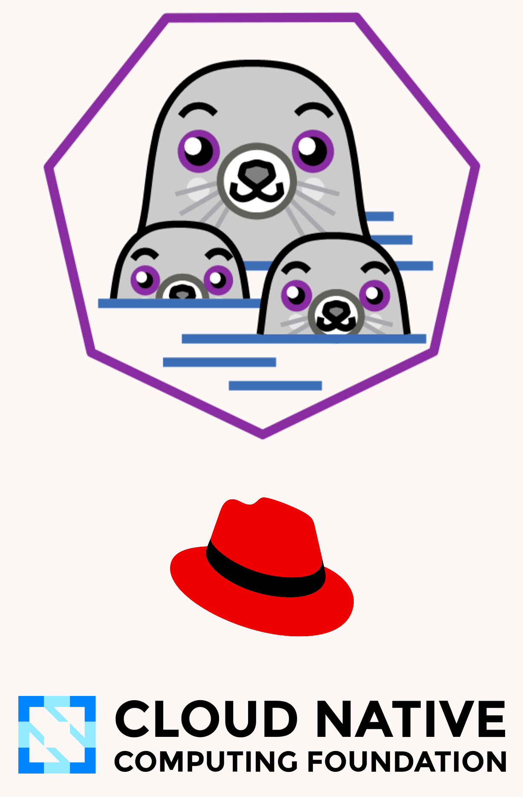

---
theme:
  name: catppuccin-latte
title: Play with Kube using Podman
# sub_title: Podman - The Next Generation Container Engine
author: Mario Loriedo - Red Hat
---

Agenda
---

### Podman
### Kubernetes Pod
### `podman kube play`
### Supported Kubernetes Objects
### `podman kube generate`
### More Awesomeness
### Resources

<!-- end_slide -->

<!-- jump_to_middle -->
Podman
---
<!-- end_slide -->

Podman
---

<!-- We are at FOSDEM, containers room, I assuming everybody know Podman
Or at least what a container engine is.
Used to be Red Had governed but soon a CNCF Sandbox project. -->
<!-- column_layout: [2, 1] -->

<!-- column: 0 -->
```shell
$ podman run -d -p 8080:80 httpd
bc9e281309d5a9d71f3cef0a48d76b1cc6097afbf2bd7...

$ curl localhost:8080
<html><body><h1>It works!</h1></body></html>
```

<!-- column: 1 -->



<!-- end_slide -->

<!-- 
Podman Pods
---

podman pod create -p 8080:80 --name mypod
podman create --pod mypod --name myapp httpd
podman pod start mypod
podman ps

podman pod stop mypod
podman pod rm mypod

-->

<!-- jump_to_middle -->
Kubernetes Pod
---
<!-- end_slide -->

Kubernetes Pod
---
```file {1-30|10-18|19-25|26-29} +line_numbers
path: pod.yaml
language: yaml
```
<!-- end_slide -->

<!-- jump_to_middle -->

`podman kube play`
---

<!-- end_slide -->

`podman kube play`
---

```bash +exec
podman kube play ./pod.yaml
```
<!-- pause -->
```bash +exec
curl -s localhost:8080
```
<!-- pause -->
```bash +exec
curl -s localhost:8080
```
<!-- pause -->
```bash +exec
podman kube down ./pod.yaml
```
<!-- end_slide -->

`podman kube play --build`
---
```bash +exec
podman rmi localhost/hello-py-aioweb:latest
```
<!-- pause -->
```bash +exec
podman kube play ./pod.yaml --build
```
<!-- pause -->
```bash +exec
podman kube down ./pod.yaml
```
<!-- end_slide -->

Supported Kubernetes Objects
---

- Pod
- Deployment
- PersistentVolumeClaim
- ConfigMap
- Secret
- DaemonSet
- Job

<!-- end_slide -->

`podman kube generate`
---

```bash +exec
podman run -d -p 8080:80 httpd
```
<!-- pause -->
```bash +exec
ID=$(podman ps --last 1 -q)
podman kube generate ${ID}
```
<!-- pause -->
```bash +exec
podman rm --force --all
```
<!-- end_slide -->

More (Podman) Awesomeness
---

- Rootless and Daemonless
- Build Farms
- Image Volumes
- Quadlet
- Podmansh

<!-- end_slide -->

To Learn More
---

- https://podman.io
- The Source Code [github.com/containers/](https://github.com/container/)
- Axel Talk about Quadlets at 3:30pm
- https://github.com/mfontanini/presenterm

<!-- end_slide -->
