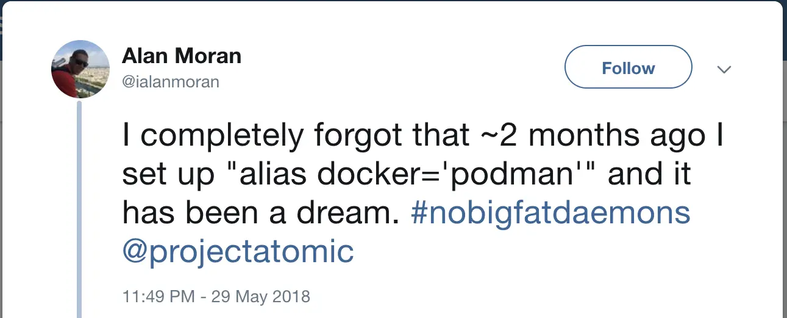
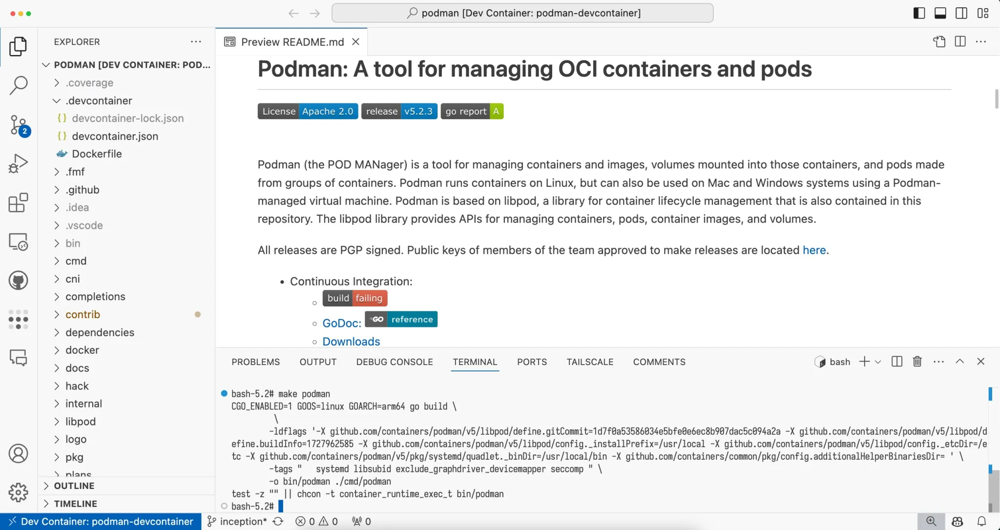
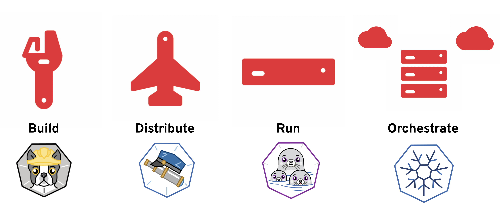
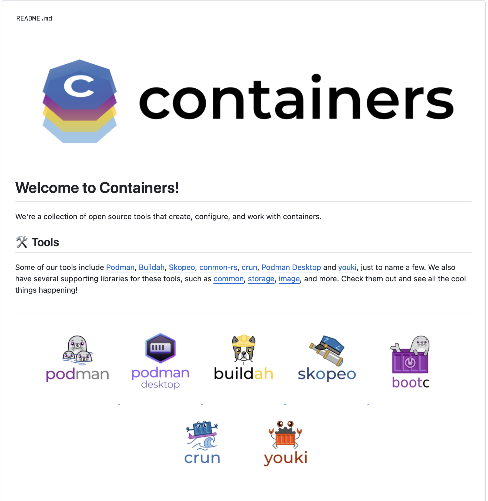

---
theme:
  name: light
title: Podman CLI
sub_title: Podman - The Next Generation Container Engine
author: Mario Loriedo - Red Hat
---

Agenda
---

### History
### Docker Compatibility
### A Next Generation Container Engine
### CRI-O, Buildah, Skopeo and GitHub containers Organization
### Contributing

<!-- end_slide -->

History
---
<!-- column_layout: [1, 1] -->
<!-- column: 0 -->
## March 2013
- Docker, based on LXC, was released as open-source
<!-- pause -->
<!-- new_line -->
## June 2014
- Kubernetes is announced at DockerCon
<!-- pause -->
<!-- new_line -->
## June 2015
- The Open Container Initiative (OCI) is started
<!-- pause -->
<!-- column: 1 -->
## January 2016
- Skopeo is released, a tool for managing container images
<!-- pause -->
<!-- new_line -->
## January 2017
- Buildah is released, a tool for building container images
<!-- pause -->
<!-- new_line -->
## January 2018
- Podman is released
<!-- end_slide -->

<!-- jump_to_middle -->
Docker Compatibility
---
<!-- end_slide -->


<!-- end_slide -->

The simplest container
---
```bash +exec
podman run hellossss
```
<!-- end_slide -->

Exposing ports
---
```bash +exec
podman run -d -p 8080:80 httpd
```
<!-- pause -->
```bash +exec
curl -s localhost:8080
```
<!-- pause -->
```bash +exec
podman rm --force --all
```
<!-- end_slide -->

Mounting volumes
---
```bash +exec
cat ./hello
```
<!-- pause -->
```bash +exec
podman run -t --rm \
           -v $PWD:/volume fedora \
           cat /volume/hello
```
<!-- end_slide -->

Listening to the Docker REST API
---
```bash +exec
curl -s \
     --unix-socket /var/run/docker.sock \
     http://d/v1.0.0/images/json | \
     jq '.[].Id'
```
<!-- pause -->
```bash +exec
podman images
```
<!-- end_slide -->

podman compose
---
```file {1-2|4-9|10-18} +line_numbers
path: compose.yaml
language: yaml
```
<!-- end_slide -->

podman compose
---
```bash +exec
podman compose up -d
```
<!-- pause -->
```bash +exec
curl -s localhost:8080
```
<!-- pause -->
```bash +exec
curl -s localhost:8080
```
<!-- pause -->
```bash +exec
podman compose down
```
<!-- end_slide -->

podman machine
---
```bash +exec
podman machine stop
```
<!-- pause -->
```bash +exec
podman machine start
```
<!-- end_slide -->

Dockerfile with HerDoc
---
```file
path: heredoc.Dockerfile
language: docker
```
<!-- end_slide -->

devcontainer.json support
---

<!-- end_slide -->

<!-- jump_to_middle -->
A Next Generation Container Engine
---
<!-- end_slide -->

Security: rootless
---
```shell
$ id
uid=1000(mariolet) gid=1000(mariolet) groups=1000(mariolet),10(wheel) context=system_u:system_r:unconfined_t:s0-s0:c0.c1023
$
$
$ podman run hello
!... Hello Podman World ...!

         .--"--.
       / -     - \
      / (O)   (O) \
   ~~~| -=(,Y,)=- |
    .---. /`  \   |~~
 ~/  o  o \~~~~.----. ~~
  | =(X)= |~  / (O (O) \
   ~~~~~~~  ~| =(Y_)=-  |
  ~~~~    ~~~|   U      |~~

Project:   https://github.com/containers/podman
Website:   https://podman.io
Desktop:   https://podman-desktop.io
Documents: https://docs.podman.io
YouTube:   https://youtube.com/@Podman
X/Twitter: @Podman_io
Mastodon:  @Podman_io@fosstodon.org
```
<!-- end_slide -->

Security: daemonless
---
```bash +exec +acquire_terminal
ssh linode
```
<!-- end_slide -->

Enterprise: Build Farms
---
Build multi architecture container images on a farm of machines
```bash
$ podman farm create my-farm
$ podman farm build -t my-image .
```
<!-- end_slide -->

Enterprise: Image Volumes
---
```bash +exec
podman run -t --rm \
           --mount=type=image,source=alpine,destination=/alpine-image,rw=true \
           fedora \
           ls -l /alpine-image
```
<!-- end_slide -->

kube play
---
*Kubernetes Pods without Kubernetes*
```file {10-22|23-29|30-33} +line_numbers
path: pod.yaml
language: yaml
```
<!-- end_slide -->

kube play
---
*Kubernetes Pods without Kubernetes*
```bash +exec
podman kube play ./pod.yaml
```
<!-- pause -->
```bash +exec
curl -s localhost:8080
```
<!-- pause -->
```bash +exec
curl -s localhost:8080
```
<!-- pause -->
```bash +exec
podman kube down ./pod.yaml
```
<!-- end_slide -->

kube generate
---
*From local containers to Kubernetes Pods*
```bash +exec
podman run -d -p 8080:80 httpd
```
<!-- pause -->
```bash +exec
ID=$(podman ps --last 1 -q)
podman kube generate ${ID}
```
<!-- pause -->
```bash +exec
podman rm --force --all
```
<!-- end_slide -->

systemd Integration
---

- Quadlet
- Podmansh
<!-- end_slide -->

<!-- jump_to_middle -->
CRI-O, Buildah, Skopeo and GitHub containers Organization
---
<!-- end_slide -->

The Container Swiss Army Knives
---


<!-- end_slide -->

GitHub Containers Organization
---


<!-- end_slide -->

<!-- jump_to_middle -->
Contributing to Podman
---
<!-- end_slide -->

Contributing
---

[github.com/containers/podman](https://github.com/container/podman)
<!-- end_slide -->
