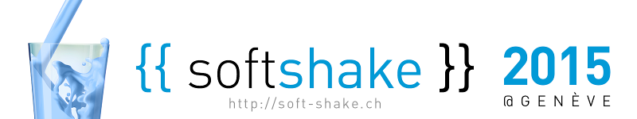
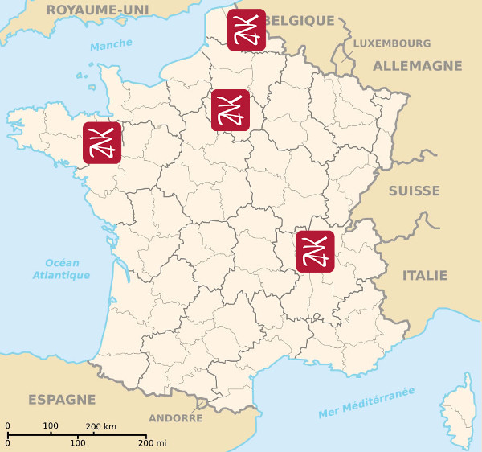
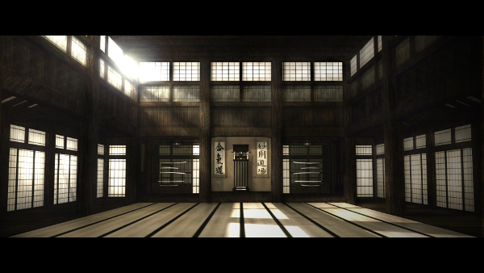

name: inverse
layout: true
class: center, middle, inverse
---
layout: false
class: center
      
# Pair Programming à distance
   

.left[]

---
layout: false
.left-column[
  ## Agenda
]
.right-column[

1. Le contexte

2. La recherche des outils

3. Un premier outil : Floobits

4. Un deuxième outil : Saros

5. Un troisième outil : tmate

6. La partie audio

7. Conclusions
]
---
template: inverse

## Hello

---

.large[
.left[Je suis Mario........................]
.left[CTO @ Zenika Paris............]
.left[Software Craftsman..........]

.left[[mariolet](https://twitter.com/mariolet)..............................]
.left[[l0rd](https://github.com/l0rd).....................................]
]

---

template: inverse

## Le contexte

---

.left-column[
  ## Le contexte
  ### Zenika
]
.right-column[

]

---

.left-column[
  ## Le contexte
  ### Zenika
  ### Fun
]
.right-column[

]

---

.left-column[
  ## Le contexte
  ### Zenika
  ### Fun
  ### Coding Dojo
]
.right-column[
   

]

---

.left-column[
  ## Le contexte
  ### Zenika
  ### Fun
  ### Coding Dojo
]
.right-column[
### Ping pong pair programming

### Un dojo par mois

### Des sujets différents
- Bowling
- Démineur
- Project Euler
- Gilded Rose

### Partager partager partager !

]

---

template: inverse

## La recherche des outils

---

.left-column[
  ## La recherche des outils
  ### Les critères
]
.right-column[

## Le besoin
- IDE avancé java

- Possibilité de éditer à plusieurs en même temps 

- Version gratuite

## Nice to have
- Chacun utilise son IDE préféré

- Open Source

- Deux (voir plus) curseurs

]

---

.left-column[
  ## La recherche des outils
  ### Les critères
  ### Les candidats
]
.right-column[
### La liste des outils qui ont été pris en compte .red[*]
.large[
- Screenhero
- Floobits
- Codepad - Etherpad
- SourceLair
- Cloud9
- Koding
- Codenvy
- Saros
]

.footnote[.red[*] merci [@ludnadez](https://twitter.com/ludnadez)]
]

---

.left-column[
  ## La recherche des outils
  ### Les critères
  ### Les candidats
  ### Les finalistes
]
.right-column[
### La liste des outils qui ont été pris en compte .red[*]
.large[
- ~~Screenhero~~
- Floobits
- ~~Codepad - Etherpad~~
- ~~SourceLair~~
- ~~Cloud9~~
- ~~Koding~~
- ~~Codenvy~~
- Saros
]

.footnote[.red[*] merci [@ludnadez](https://twitter.com/ludnadez)]
]

---

template: inverse

## Un premier outil: Floobits

---

background-repeat: cover
background-image: url(images/floobits.png)

---

.left-column[
  ## Floobits
  ### .red[Charactéristiques]
]
.right-column[
# 
  
### Plusieurs IDE supportés     

### Code synchronisé instantanément et chacun son curseurs

### Architecture centralisée

### Deux versions:
  * Backend hebergé sur floobits.com
  * [Floobits Enteprise](https://floobits.com/enterprise) : backend *on-premise*
]

---

.left-column[
  ## Floobits
  ### Charactéristiques
  ### .red[Avantages]
]
.right-column[
# 
  

### Collaboration inter-IDE
Chacun utilise son IDE préféré (eg. VIM et Emacs ensemble)

### Setup facile
* Install : plugin pour IDE
* Pargage de workspace : avec une URL

### Bonne documentation
]

---

.left-column[
  ## Floobits
  ### Charactéristiques
  ### Avantages
  ### .red[Inconvéniants]
]
.right-column[
# 
  

### Supporte uniquement IntelliJ comme IDE Java

### Protocole propriétaire

### (Rares) problèmes de synchronisation

]

---

.left-column[
  ## Floobits
  ### Charactéristiques
  ### Avantages
  ### Inconvéniants
  ### .red[Démo]
]
.right-column[
# 
  

.right[]
.right[[http://www.commitstrip.com/en/](http://www.commitstrip.com/en/)]
]

---

template: inverse

## Un deuxième outil: Saros

---

background-repeat: cover
background-image: url(images/saros.png)

---

.left-column[
  ## Saros
  ### .red[Charactéristiques]
]
.right-column[
# 
  

### Plugin eclipse

### Code synchronisé instantanément et chacun son curseurs

### Architecture distribué
- Un développeur joue le rôle de host
- Utilse le protocole XMPP pour la comunication

### Projet Open Source maintenu par l'université de Berlin

]

---

.left-column[
  ## Saros
  ### Charactéristiques
  ### .red[Avantages]
]
.right-column[
# 
  

### Standards ouverts
- Protocolle de comunication ouvert (XMPP)
- Projet Open Source
- Support d'un IDE Open Source (eclipse)

### Décentralisé
Le code ne passe jamais à travers des intermédiaires

### Setup facile
Install : Il suffit d'installer un plugin eclipse

]

---

.left-column[
  ## Saros
  ### Charactéristiques
  ### Avantages
  ### .red[Inconvéniants]
]
.right-column[
# 
  

### Supporte un seul IDE (Eclipse)

### Certaines versions de Eclipse peuvent présenter des problèmes (STS)

### Setup d'un serveur XMPP pour une installation complètement indépendante

]

---

.left-column[
  ## Saros
  ### Charactéristiques
  ### Avantages
  ### Inconvéniants
  ### .red[Démo]
]
.right-column[
# 
  
  
.right[]
]

---

template: inverse

## Un troisième outil: tmate

---

background-repeat: cover
background-image: url(images/tmate.png)

---

.left-column[
  ## tmate
  ### .red[Charactéristiques]
]
.right-column[
# 
  

### Fork de tmux (terminal multiplexer)

### Outil pour le partage de terminal
- Un seul curseur
- Environnement non-graphique
 
### Architecture centralisée

]

---

.left-column[
  ## tmate
  ### .red[Charactéristiques]
]
.right-column[
# 

]

---

.left-column[
  ## tmate
  ### Charactéristiques
  ### .red[Avantages]
]
.right-column[
# 
  
### Standard ouverts
Projet Open Source et se base sur tmux

### Setup facile
Tmate sur pour les host
Un client SSH pour les autres

### Rapide

]

---

.left-column[
  ## tmate
  ### Charactéristiques
  ### Avantages
  ### .red[Inconvéniants]
]
.right-column[
# 
  
### Pas adapté pour outils graphiques (Eclipse etc...)

### Un seul curseur

### Sécurité : accès au shell distant

]

---

.left-column[
  ## tmate
  ### Charactéristiques
  ### Avantages
  ### Inconvéniants
  ### .red[Démo]
]
.right-column[
# 
  
.right[]
.right[[http://www.commitstrip.com/en/](http://www.commitstrip.com/en/)]
]

---
template: inverse

## La partie audio
---

# La partie audio

## Plusieurs options :
### 1. Sans audio
### 2. Skype, Google Hangouts
### 3. Téléphone portable
### 4. Gaming VoIP (Teamspeak, mumble etc...)

---
template: inverse

## Le kit du remote pair programmer
  

.left[
### 1. Laptop
### 2. Casque avec micro
### 3. Téléphone portable
### 4. Agenda partagée en avance
### 5. Setup des outils en avance
]

---

template: inverse

## merci
[mario.loriedo@zenika.com]

[@mariolet]

