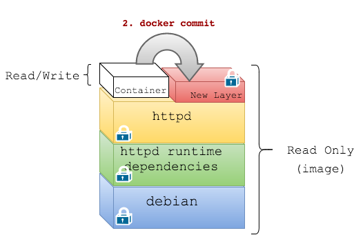
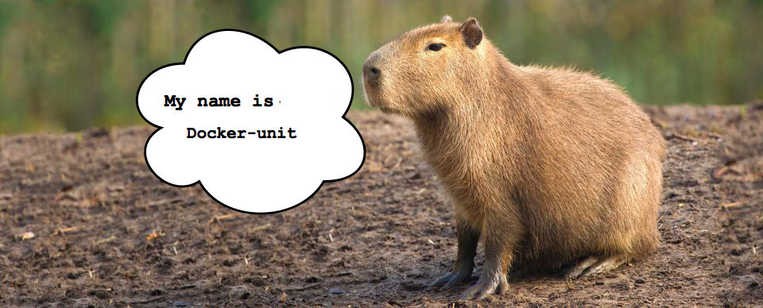

name: inverse
layout: true
class: center, middle, inverse
---

# docker-unit
[JUnit pour Dockerfile]

---
layout: false

.large[
.left[Je suis Mario...................................]
.left[CTO @ Zenika Paris.......................]
.left[Docker certified trainer..............]
.left[[doclipser](https://github.com/domeide/doclipser) and [sublime docker](https://github.com/domeide/sublime-docker)......]


.left[[mariolet](https://twitter.com/mariolet)........................................]
.left[[l0rd](https://github.com/l0rd)................................................]
]

---

.left-column[
## docker-unit
### build
]
.right-column[

### Dockerfile and Image layers
<br><br>


]

---

.left-column[
## docker-unit
### build
### unit tests
]
.right-column[

### Dockerfile with tests
<br><br>


]

---

.left-column[
## docker-unit
### build
### unit tests
### example
]
.right-column[

### Dockerfile with tests
```Dockerfile
FROM tomcat:8.0.28-jre8

RUN useradd -d /home/tomcat -m -s /bin/bash tomcat

# TESTS
RUN getent passwd tomcat
RUN bash -c "test -f /home/tomcat/.profile"

# TESTS
RUN bash -c "test ! -f /usr/local/tomcat/webapps/hello-nantes.war"

COPY hello-nantes.war /usr/local/tomcat/webapps/

# TESTS
RUN bash -c "test -f /usr/local/tomcat/webapps/hello-nantes.war"

CMD catalina.sh run
```

]

---

.left-column[
## docker-unit
### build
### unit tests
### example
### desiderata
]
.right-column[

.large[
Prérequis :
<br>
- Aucun effet de bord sur l'image générée

- Séparation du code de .red[test] et du code de .red[prod]
]
]
---

template: inverse

## Demo
[les layers de test]

---

.left-column[
## docker-unit
### build
### unit tests
### example
### desiderata
### internals 1...
]
.right-column[
### La première étape d'un build consiste à créer un conteneur temporaire : une couche R/W est créé au dessus d'une image.
<br><br>


]

---

.left-column[
## docker-unit
### build
### unit tests
### example
### desiderata
### internals 1...2...
]
.right-column[

### La deuxième étape est un `docker commit`: une nouvelle image est créé à partir du conteneur.
<br><br>


]

---

.left-column[
## docker-unit
### build
### unit tests
### example
### desiderata
### internals 1...2...3
]
.right-column[

### La troisième et dernière étape consiste à éliminer le conteneur temporaire.
<br><br>


]

---

.left-column[
## docker-unit
### build
### unit tests
### example
### desiderata
### internals 1...2...3
### injection
]
.right-column[


```Dockerfile
...

# test previous step
RUN test -f /home/tomcat/.profile

...
```

Dans le cas des tests on souhaite :

.large[1. `docker run`
2. ~~`docker commit`~~
3. `docker rm`
]
]

---

template: inverse

## Docker-unit
[ JUnit pour Dockerfile]

---



### Framework de test pour Dockerfile

- Les tests sont décrits dans des fichiers séparés (Dockerfile_test)
- Les tests n'ont pas de effet de bord sur les images
- Se base sur le projet `dockramp`
- Le code se trouve sur github


---

.left-column[
  ## Docker-unit
  ### Features
  #### - EPHEMERAL
]
.right-column[
### Support de l'instruction EPHEMERAL dans les Dockerfile

```Docker
# Exemple de test qui vérifie si le file foo.txt existe
EPHEMERAL test -f foo.txt
```

Dans le cas de l'instruction `EPHEMERAL` l'operation `commit` n'est pas exécutée :
.large[1. `docker run`
2. ~~`docker commit`~~
3. `docker rm`
]
]

---

.left-column[
## Docker-unit
### Features
#### - EPHEMERAL
#### - Testfile
]
.right-column[
### Support de Testfile et de ASSERT

```Dockerfile
# Dockerfile_test

ASSERT_TRUE $(whoami)=mario # => EPHEMERAL test $(whoami)=mario

ASSERT_FALSE -f foo.txt      # => EPHEMERAL test ! -f foo.txt
```
]

---

.left-column[
## Docker-unit
### Features
#### - EPHEMERAL
#### - Testfile
#### - Before/After
]
.right-column[
### Support des instructions @BEFORE et @AFTER

```Dockerfile
# Dockerfile_test

@BEFORE RUN_USERADD
ASSERT_TRUE $(whoami)=root

@AFTER COPY_HELLO
ASSERT_TRUE -f /usr/local/tomcat/webapps/hello-rouen.war
```

```Dockerfile
# Dockerfile

RUN useradd -d /home/mario -u 1000 -m -s /bin/bash mario

COPY hello-rouen.war /usr/local/tomcat/webapps/
```
]

---

.left-column[
## Docker-unit
### Features
#### - EPHEMERAL
#### - Testfile
#### - Before/After
#### - Resultats
]
.right-column[

### Affichage des résultats des tests

```bash
$ docker-unit .
(...)
----
Run 4 tests: 4 PASS and 0 FAIL
----
```
]

---

.left-column[
## Docker-unit
### Features
#### - EPHEMERAL
#### - Testfile
#### - Before/After
#### - Resultats
#### - Templates
]
.right-column[
### Support de tests prédéfinis (templates)
- `USER_EXISTS` mario
- `FILE_EXISTS` foo.txt
- `OS_VERSION_MATCH` "ubuntu 14.04"
- `CURRENT_USER_MATCH` "mario"
- `IS_INSTALLED` "vim"
- `IS_RUNNING` "httpd"
- `IS_LISTENING_ON_PORT` 80
]

---

.left-column[
## Docker-unit
### Features
### Démo
]
.right-column[
<br><br>

.right[]
.right[[http://www.commitstrip.com/en/](http://www.commitstrip.com/en/)]
]

---

.left-column[
## Docker-unit
### Features
### Démo
### Next version
#### - INCLUDE
]
.right-column[
### Support de @INCLUDE

```Dockerfile
# Capyfile

@AFTER CREATE_FOO
@INCLUDE test_foo.sh
ASSERT_TRUE test_foo.sh
```
]

---

.left-column[
## Docker-unit
### Features
### Démo
### Next version
#### - INCLUDE
#### - IMPORT
]
.right-column[
### Support de @IMPORT
```Dockerfile
# Capyfile

@AFTER CREATE_FOO
@IMPORT serverspec
@IMPORT bats
@IMPORT openscap
ASSERT_TRUE test_foo.sh

```
]

---

.left-column[
  ## Docker-unit
## Docker-unit
### Features
### Démo
### Next version
#### - INCLUDE
#### - IMPORT
#### - SETUP
]
.right-column[
### Support de @SETUP and @TEARDOWN
```Dockerfile
# Capyfile

@SETUP
@IMPORT bats

```
]


---

.left-column[
## Docker-unit
### Features
### Démo
### Next version
### Roadmap
]
.right-column[
### Docker-unit Roadmap
<br><br>

- .green[~~Support de l'instruction `EPHEMERAL` dans les Dockerfile~~]

- .green[~~Support de Capyfile et de `ASSERT_TRUE`~~]

- .green[~~Affichage de résultats des tests~~]

- .green[~~Support des instructions `@BEFORE` et `@AFTER`~~]

- Support de tests pré-définis

- Support de `@INCLUDE`

- Support de `@SETUP` and `@TEARDOWN`

]

---

.left-column[
  ## Conclusion
]
.right-column[
<br><br>

- Mettre des tests dans les dockerfile

- L'instruction EPHEMERAL permet d'avoir d'éviter les effets de bord

- docker-unit est un framework de test de Dockerfile

]

---

template: inverse

## merci
http://github.com/l0rd/docker-unit/

http://l0rd.github.com/talks/capy/

@mariolet

mario.loriedo@zenika.com
