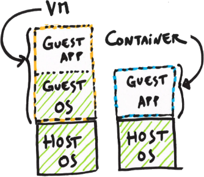
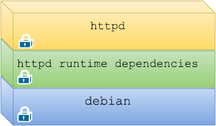
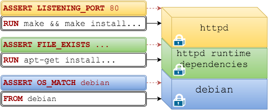

name: inverse
layout: true
class: center, middle, inverse
---

layout: false
class: center
<br><br><br><br><br><br>
# Test Driven Infrastructure with Docker
[Because you want to test everything in life]
<br><br><br>


.left[]
---
layout: false
.left-column[
  ## Agenda
]
.right-column[

1. Docker en 5 minutes

2. Code et Infrastructure

3. Test Driven Infrastructure

4. Détails d'un build Docker

7. capy
]

---

template: inverse

## Hello

---


.large[
.left[Je suis Mario...................................]
.left[CTO @ Zenika Paris.......................]
.left[Docker certified trainer..............]
.left[[doclipser](https://github.com/domeide/doclipser) and [sublime docker](https://github.com/domeide/sublime-docker)......]


.left[[mariolet](https://twitter.com/mariolet)........................................]
.left[[l0rd](https://github.com/l0rd)................................................]
]

---
template: inverse

## Docker en 5 minutes

---

.left-column[
  ## Docker en 5 minutes
  ### Comme une .red[VM]
]
.right-column[
### Les conteneurs ont des charactéristiques similaires aux VMs traditionelles :

- Ils permettent de *packager* une application dans un environnment isolé

- Facilitent la distribution d'une application

- Optimisent l'utilisation des serveurs physiques
]

  

---

.left-column[
  ## Docker en 5 minutes
  ### Comme une .red[VM]
  ### .red[Pas] une VM
]
.right-column[
### Les conteneurs sont différents des VMs traditionelles :

- La virtualisation se fait au niveau du système d'exploitation :
  + optimisation *extreme*
  + isolation *moins profonde* 

- Utilisation de la technologie Copy On Write :
  + utilistion plus efficace de l'espace disque et 
  + création *instantanée* de nouveaux conteneurs
]

 

---

.left-column[
  ## Docker en 5 minutes
  ### Comme une .red[VM]
  ### .red[Pas] une VM
  ### docker run
]
.right-column[


### Création et execution d'un conteneur

```bash
docker run -d httpd
```


### Création et execution de 100 conteneurs

```bash
for i in `seq 1 100`; do 
  docker run -d --name apache$i httpd;
done
```
]

---

.left-column[
  ## Docker en 5 minutes
  ### Comme une .red[VM]
  ### .red[Pas] une VM
  ### docker run
  ### Images
]
.right-column[
.center[
```bash
docker run -d httpd
```
]

### Les images sont .red[read only] et sont découpées en .red[couches]

.center[]

### Si l'image n'existe pas en local elle est récurpérée du .red[DockerHub]

```bash
Unable to find image 'httpd:latest' locally
latest: Pulling from library/httpd
```
]

---
layout: false
.left-column[
  ## Docker en 5 minutes
  ### Comme une .red[VM]
  ### .red[Pas] une VM
  ### docker run
  ### Images
  ### Dockerfile
]
.right-column[
```Dockerfile
FROM debian

# install httpd runtime dependencies
RUN apt-get update \
    && apt-get install -y \
    libapr1 \
    libaprutil1 \
    ....

# build and install apache
RUN  make \
     && make install \

```
]

.right[]

---
template: inverse

## Code et Infrastructure

---

.left-column[
## Code et Infrastructure
### Infrastructure as code
]
.right-column[
### Le *provisioning* et la configuration de l'infrastructure sont définis dans des fichiers de code source
<br>

]

---

.left-column[
## Code et Infrastructure
### Infrastructure as code
### Outils
]
.right-column[
<br>
.pull-left[
.red[Configuration Management]
<pre><code>- Ansible
- Chef
- Puppet
</code></pre>
]
.pull-right[
.red[Docker Inc.]
<pre><code>- Docker compose
- Docker swarm
- Docker machine
</code></pre>
]
.pull-left[
.red[Containers Engines]
<pre><code>- Docker
- rootkit
- runc
</code></pre>
]
.pull-right[
.red[Shedulers]
<pre><code>- Kubernetes
- Mesos
 
</code></pre>
]
.pull-left[
.red[Service Discovery]
<pre><code>- Consul
- etcd
- zookeeper
</code></pre>
]
.pull-right[
.red[Load Balancers]
<pre><code>- HAProxy
- Traefik
- NGINX
</code></pre>
]

]

---

.left-column[
  ## Code et Infrastructure
  ### Infrastructure as code
  ### Outils
  ### Bonnes pratiques
]
.right-column[
### Un des avantages de l'Infrastructure as Code c'est la possibilité d'appliquer les .red[pratiques d'ingénierie logicielle] à l'infrastructure :

.large[
- Versionning du code

- Design patterns

- Déploiements fréquents

- Tests automatisés
]  
]

---

template: inverse

## Test Driven Infrastructure

---

.left-column[
## Test Driven Infrastructure
### Types de tests
]
.right-column[
### Les différents types de tests appliqués à l'infrastructure
<br><br>
.large[**Tests unitaires**] : test d'un seul composant de l'infrastructure (e.g. une image Docker)
<br><br>
.large[**Tests d'intégration**] : test de l'intégration des composants dans l'infrastructure (e.g. avec un compose file)
<br><br>
.large[**Tests d'accéptance**] : test de scenario d'utilisation de l'infrastucture (e.g. ServerSpec)
]

---

.left-column[
## Test Driven Infrastructure
### Types de tests
### L'intérêt des tests 1
]
.right-column[
### Sans tests automatisés le coût d'un changements augmente exponentiellement en fonction du temps
<br><br>
<br>
image source: [InfoQ.com](http://www.infoq.com/articles/agile-practice-patterns&rct)
]

---

.left-column[
## Test Driven Infrastructure
### Types de tests
### L'intérêt des tests 1 et 2
]
.right-column[
### Plus tard on trouve un bug plus cher sera le fix
<br><br> 

  
]

---

.left-column[
## Test Driven Infrastructure
### Types de tests
### L'intérêt des tests 1 et 2
### Dockefile unit testing
]
.right-column[

### Dockerfile Unit Testing
<br><br>


Les couches sont téstées individuellement

Les tests ne doivent pas modifier l'image

__Les tests peuvent être injéctés et executés au moment du build de l'image__

]

---

.left-column[
## Test Driven Infrastructure
### Types de tests
### L'intérêt des tests 1 et 2
### Dockefile Unit Testing
### Test Driven
]
.right-column[
### Dockerfile Test Driven Development
<br><br>
.large[.red[Red]] : Écrire un test et verifier qu'il ne passe pas.
<br><br>


.large[.green[Green]] : Écrire le code du Dockerfile nécéssaire à faire passer le test.
<br><br>


.large[Refactor] : Améliorer le code du Dockerfile en vérifiant que les tests passent toujours.

]

---

template: inverse

## Détails d'un build Docker

---

.left-column[
## Détails d'un build Docker
### Build manuel 1...
]
.right-column[
### La première étape d'un build consiste à créer un conteneur temporaire : une couche R/W est crée au dessus d'une image.
<br><br>


]

---

.left-column[
## Détails d'un build Docker
### Build manuel 1...2...
]
.right-column[

### La deuxième étape est un `docker commit`: une nouvelle image est ccrée à partir du conteneur. 
<br><br>


]

---

.left-column[
## Détails d'un build Docker
### Build manuel 1...2...3
]
.right-column[

### La troisième et dernière étape consiste à éliminer le conteneur temporaire. 
<br><br>


]

---

.left-column[
## Détails d'un build Docker
### Build manuel 1...2...3
### Build d'un Dockerfile
]
.right-column[

```Dockerfile
FROM debian

# install httpd runtime dependencies
RUN apt-get update \
    && apt-get install -y \
    libapr1 \
    libaprutil1 \
    ....

# build and install apache
RUN  make \
     && make install \

```


Pour chaque instruction du Dockerfile les 3 étapes manuelles sont répétées automatiquement :
.large[1. `docker run`
2. `docker commit`
3. `docker rm`
]
]

---

.left-column[
## Détails d'un build Docker
### Build manuel 1...2...3
### Build d'un Dockerfile
### Injéction de tests
]
.right-column[

```Dockerfile
FROM debian

# install httpd runtime dependencies
RUN apt-get update \
    && apt-get install -y \
    libapr1 \
    libaprutil1 \
    ....
``` 

```Dockerfile
# test previous step
RUN test -f libapr1
```

```Dockerfile
# build and install apache
RUN  make \
     && make install \
```

Mais dans le cas du tests il faudrait avoir :

.large[1. `docker run`
2. ~~`docker commit`~~
3. `docker rm`
]
]

---

template: inverse

## Capy

---


### Framework de test pour Dockerfile

### Fork du projet dockramp :
- dockramp est un client Docker qui ne fait que `docker build` 
- rajout de l'instruction `EPHEMERAL` pour les Dockerfile
- support de fichiers de tests avec des instructions ASSERT


---

.left-column[
  ## capy
  ### Démo
]
.right-column[
<br><br>

.right[]
.right[[http://www.commitstrip.com/en/](http://www.commitstrip.com/en/)]
]

---

.left-column[
  ## capy
  ### Démo
  ### Roadmap
]
.right-column[
### capy Roadmap
<br><br>

- .green[~~Support de l'instruction `EPHEMERAL` dans les Dockerfile~~]

- Support de Capyfile et de `ASSERT_TRUE`

- Affichage de résultats des tests

- Support des labels et des instructions `@BEFORE` et `@AFTER`

- Support de `@INCLUDE`

- Support de `@SETUP` and `@TEARDOWN`

- Support de tests pré-définis
]

---

.left-column[
  ## capy
  ### Démo
  ### Roadmap
  #### - EPHEMERAL
]
.right-column[
### Support de l'instruction EPHEMERAL dans les Dockerfile

```Docker
# Exemple de test qui vérifie si le file foo.txt existe
EPHEMERAL test -f foo.txt
```

Dans le cas de l'instruction `EPHEMERAL` l'operation `commit` n'est pas exécutée :
.large[1. `docker run`
2. ~~`docker commit`~~
3. `docker rm`
]
]

---

.left-column[
## capy
### Démo
### Roadmap
#### - EPHEMERAL
#### - Capyfile
]
.right-column[
### Support de Capyfile et de ASSERT_TRUE

```Dockerfile
# Capyfile

ASSERT_TRUE $(whoami)=mario # => EPHEMERAL test $(whoami)=mario

ASSERT_TRUE -f foo.txt      # => EPHEMERAL test -f foo.txt
```
]

---

.left-column[
## capy
### Démo
### Roadmap
#### - EPHEMERAL
#### - Capyfile
#### - Labels
]
.right-column[
### Support des labels et des instructions @BEFORE et @AFTER

```Dockerfile
# Capyfile

@BEFORE RUN_COMMAND
ASSERT_TRUE $(whoami)=mario

@AFTER CREATE_FOO
ASSERT_TRUE -f foo.txt
```

```Dockerfile
# Dockerfile

# @RUN_COMMAND@
RUN useradd -d /home/mario -u 1000 -m -s /bin/bash mario

# @CREATE_FOO@
ASSERT_TRUE -f foo.txt
```
]

---

.left-column[
## capy
### Démo
### Roadmap
#### - EPHEMERAL
#### - Capyfile
#### - Labels
#### - Résultats
]
.right-column[

### Affichage des résultats des tests

```bash
$ capy .
(...)
Run 5 tests. 1 Failed and 4 Successful.
```
]

---

.left-column[
## capy
### Démo
### Roadmap
#### - EPHEMERAL
#### - Capyfile
#### - Labels
#### - Résultats
#### - INCLUDE
]
.right-column[
### Support de @INCLUDE

```Dockerfile
# Capyfile

@AFTER CREATE_FOO
@INCLUDE test_foo.sh
ASSERT_TRUE test_foo.sh
```
]

---

.left-column[
## capy
### Démo
### Roadmap
#### - EPHEMERAL
#### - Capyfile
#### - Labels
#### - Résultats
#### - INCLUDE
#### - IMPORT
]
.right-column[
### Support de @IMPORT
```Dockerfile
# Capyfile

@AFTER CREATE_FOO
@IMPORT serverspec
@IMPORT bats
ASSERT_TRUE test_foo.sh

```
]

---

.left-column[
  ## capy
### Démo
### Roadmap
#### - EPHEMERAL
#### - Capyfile
#### - Labels
#### - Résultats
#### - ...
#### - SETUP
]
.right-column[
### Support de @SETUP and @TEARDOWN
```Dockerfile
# Capyfile

@SETUP
@IMPORT bats

```
]

---

.left-column[
## capy
### Démo
### Roadmap
#### - EPHEMERAL
#### - Capyfile
#### - Labels
#### - Résultats  
#### - ...
#### - Templates
]
.right-column[
### Support de tests prédéfinis (templates)
- `FILE_EXISTS` foo.txt 
- `OS_VERSION_MATCH` "ubuntu 14.04"
- `CURRENT_USER_MATCH` "mario"
- `IS_INSTALLED` "vim"
- `IS_RUNNING` "httpd"
- `IS_LISTENING_ON_PORT` 80
]

---

template: inverse

## merci
[mario.loriedo@zenika.com]

[@mariolet]
