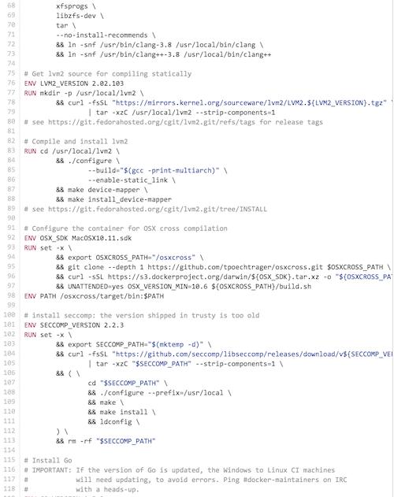
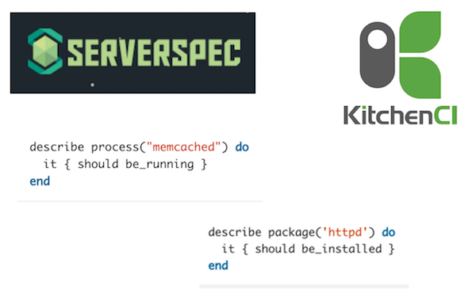

name: inverse
layout: true
class: center, middle, inverse
---

# Test Driven Infrastructure with Docker
[ou comment appliquer le TDD à l'infrastructure]

---

template: inverse

## Infrastructure as code
[même format mêmes outils]

---

layout: false
.left-column[
  ## IaC
  ### Code Source
]
.right-column[
### Le code : un Dockerfile

<br><br>
```Dockerfile
FROM tomcat

RUN useradd tomcat

USER tomcat

COPY hello-world.war /usr/local/tomcat/webapps/

# define containers default command
CMD catalina.sh run
```

<br>

### Le repository : un SCM

.center[]

]
---

layout: false
.left-column[
  ## IaC
  ### Code Source
  ### Build
]
.right-column[
### Le build

<br>

```bash
docker build -t hello-rouen .
```

### Le livrable : une image Docker
.center[]

]


---

layout: false
.left-column[
  ## IaC
  ### Code Source
  ### Build
  ### Deploiement
]
.right-column[
### Déploiement

<br>

```bash
docker pull hello-rouen
docker run hello-rouen
```
<br>
<br>

### Les images sont récupérés du DockerHub .red[*]
.center[]


.footnote[.red[*] ou un autre registry Docker]
]

---

layout: false
.left-column[
  ## IaC
  ### Code Source
  ### Build
  ### Deploiement
  ### Docker & co.
]
.right-column[
### Docker n'a pas inventé l'IaC mais...

<br><br>

.right[]

]

---

template: inverse

## Tests
[Ecrire des tests pour valider l'infrastructures]


---

layout: false
.left-column[
  ## Les tests
  ### Nécessaires?
]
.right-column[
### En a-t-on vraiment besoin ?

]

---

layout: false
.left-column[
  ## Les tests
  ### Nécessaires?
]
.right-column[
### En a-t-on vraiment besoin ?

.right[]

]

---

layout: false
.left-column[
  ## Les tests
  ### Nécessaires?
]
.right-column[
### Souhaitez-vous découvrir un bug le jour du deploiment ?

<br><br>

.right[]

]

---

layout: false
.left-column[
  ## Les tests
  ### Nécessaires?
]
.right-column[
### Aimez-vous toucher à du code qui n'est pas couvert par des tests ?

<br>

.right[]

]

---

layout: false
.left-column[
  ## Les tests
  ### Nécessaires?
  ### Tests d'Integr
]
.right-column[
### Les tests d'intégration de l'Infrastructure as Code

<br><br>

.right[]

]

---

layout: false
.left-column[
  ## Les tests
  ### Nécessaires?
  ### Tests d'Integr
  ### Tests Unitaires
]
.right-column[
### docker-unit

```Dockerfile
# Dockerfile

RUN useradd mario

COPY hello-rouen.war /usr/local/tomcat/webapps/
```

```Dockerfile
# Dockerfile_test

@BEFORE RUN_USERADD
ASSERT_TRUE USER_EXISTS "mario"

@AFTER COPY_HELLO
ASSERT_TRUE FILE_EXISTS /usr/local/tomcat/webapps/hello-rouen.war
```


### Affichage des résultats des tests

```bash
$ docker-unit .
(...)
----
Run 4 tests: 4 PASS and 0 FAIL
----
```

]

---

template: inverse

## merci
http://github.com/l0rd/docker-unit/

http://l0rd.github.com/talks/test-driven-infra/

@mariolet

mario.loriedo@zenika.com


---

template: inverse

## Docker-unit
[ JUnit pour Dockerfile]

---


### Framework de test pour Dockerfile

- Les tests sont décrits dans des fichiers séparés (Dockerfile_test)
- Les tests n'ont pas de effet de bord sur les images
- Se base sur le projet `dockramp`
- Le code se trouve sur github


---

.left-column[
  ## Docker-unit
  ### Features
  #### - EPHEMERAL
]
.right-column[
### Support de l'instruction EPHEMERAL dans les Dockerfile

```Docker
# Exemple de test qui vérifie si le file foo.txt existe
EPHEMERAL test -f foo.txt
```

Dans le cas de l'instruction `EPHEMERAL` l'operation `commit` n'est pas exécutée :
.large[1. `docker run`
2. ~~`docker commit`~~
3. `docker rm`
]
]

---

.left-column[
## Docker-unit
### Features
#### - EPHEMERAL
#### - Testfile
]
.right-column[
### Support de Testfile et de ASSERT

```Dockerfile
# Dockerfile_test

ASSERT_TRUE $(whoami)=mario # => EPHEMERAL test $(whoami)=mario

ASSERT_FALSE -f foo.txt      # => EPHEMERAL test ! -f foo.txt
```
]

---

.left-column[
## Docker-unit
### Features
#### - EPHEMERAL
#### - Testfile
#### - Before/After
]
.right-column[
### Support des instructions @BEFORE et @AFTER

```Dockerfile
# Dockerfile_test

@BEFORE RUN_USERADD
ASSERT_TRUE $(whoami)=root

@AFTER COPY_HELLO
ASSERT_TRUE -f /usr/local/tomcat/webapps/hello-rouen.war
```

```Dockerfile
# Dockerfile

RUN useradd -d /home/mario -u 1000 -m -s /bin/bash mario

COPY hello-rouen.war /usr/local/tomcat/webapps/
```
]

---

.left-column[
## Docker-unit
### Features
#### - EPHEMERAL
#### - Testfile
#### - Before/After
#### - Resultats
]
.right-column[

### Affichage des résultats des tests

```bash
$ docker-unit .
(...)
----
Run 4 tests: 4 PASS and 0 FAIL
----
```
]

---

.left-column[
## Docker-unit
### Features
#### - EPHEMERAL
#### - Testfile
#### - Before/After
#### - Resultats
#### - Templates
]
.right-column[
### Support de tests prédéfinis (templates)
- `FILE_EXISTS` foo.txt
- `OS_VERSION_MATCH` "ubuntu 14.04"
- `CURRENT_USER_MATCH` "mario"
- `IS_INSTALLED` "vim"
- `IS_RUNNING` "httpd"
- `IS_LISTENING_ON_PORT` 80
]

---

.left-column[
## Docker-unit
### Features
### Démo
]
.right-column[
<br><br>

.right[]
.right[[http://www.commitstrip.com/en/](http://www.commitstrip.com/en/)]
]

---

.left-column[
## Docker-unit
### Features
### Démo
### Next version
#### - INCLUDE
]
.right-column[
### Support de @INCLUDE

```Dockerfile
# Capyfile

@AFTER CREATE_FOO
@INCLUDE test_foo.sh
ASSERT_TRUE test_foo.sh
```
]

---

.left-column[
## Docker-unit
### Features
### Démo
### Next version
#### - INCLUDE
#### - IMPORT
]
.right-column[
### Support de @IMPORT
```Dockerfile
# Capyfile

@AFTER CREATE_FOO
@IMPORT serverspec
@IMPORT bats
ASSERT_TRUE test_foo.sh

```
]

---

.left-column[
  ## Docker-unit
## Docker-unit
### Features
### Démo
### Next version
#### - INCLUDE
#### - IMPORT
#### - SETUP
]
.right-column[
### Support de @SETUP and @TEARDOWN
```Dockerfile
# Capyfile

@SETUP
@IMPORT bats

```
]


---

.left-column[
## Docker-unit
### Features
### Démo
### Next version
### Roadmap
]
.right-column[
### Docker-unit Roadmap
<br><br>

- .green[~~Support de l'instruction `EPHEMERAL` dans les Dockerfile~~]

- .green[~~Support de Capyfile et de `ASSERT_TRUE`~~]

- .green[~~Affichage de résultats des tests~~]

- .green[~~Support des instructions `@BEFORE` et `@AFTER`~~]

- .green[~~Support de tests pré-définis~~]

- Support de `@INCLUDE`

- Support de `@SETUP` and `@TEARDOWN`

]

---

.left-column[
  ## Conclusion
]
.right-column[
<br><br>

- Les conteneurs ne sont pas des VM

- Les pratiques de ing. logicielles appliquées à l'infra

- Test Driven Infrastructure avec Docker

- Docker-unit : JUnit pour Dockerfile

]

---

template: inverse

## merci
http://github.com/l0rd/docker-unit/

http://l0rd.github.com/talks/test-driven-infra/

@mariolet

mario.loriedo@zenika.com
